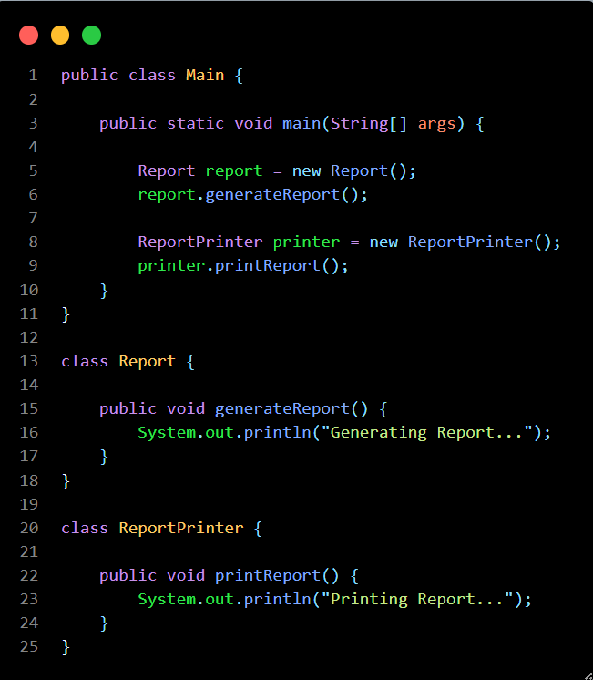
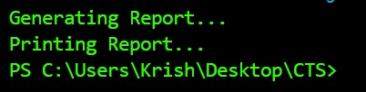

# What is SOLID?

SOLID is a set of five object-oriented design principles that help developers write maintainable, scalable, and reusable software.

## S - Single Responsibility Principle (SRP) :

A class should have only one reason to change.

Example:
- Report class -> Generate Report
- Printer class -> Print Report

## O - Open Closed Principle (OCP) :

Software entities should be open for extension but closed for modification.

Example:
- Add a new shape without changing existing code.

## L - Liskov Substitution Principle (LSP) :

Derived classes should be replaceable with their base classes without affecting correctness.

Example:
- Dog can replace Animal.
 
## I - Interface Segregation Principle (ISP) :

Clients should not be forced to implement methods they do not use.

Example:
- Separate interfaces for Printer and Scanner.

## D - Dependency Inversion Principle (DIP) :

Depend on abstractions, not concrete implementations.

Example:
- Use interfaces instead of directly depending on classes.

## Advantages of SOLID :

- Better code maintenance
- Reusable code
- Easier testing
- Reduced coupling
- Better scalability

# Code snippet :

# Output :

