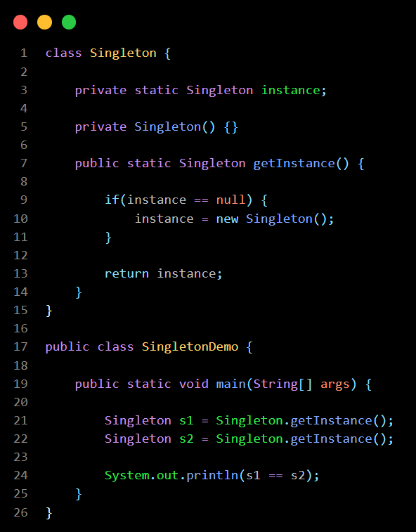
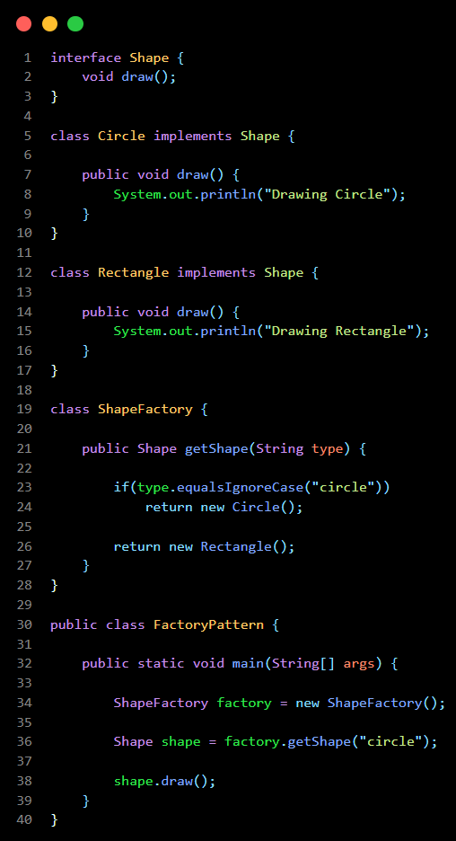
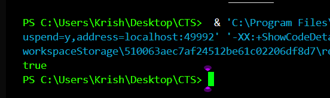
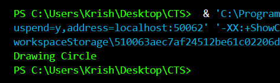

# Day 2 - Design Patterns

## What is a Design Pattern ?

A Design Pattern is a reusable solution to a common software design problem.

## Advantages :

1. Reusable code
2. Better maintainability
3. Easier scalability
4. Standardized solutions

# Singleton Pattern :

Singleton ensures that only one object of a class is created throughout the application.

Real-world Example :

- Database Connection
- Logger
- Configuration Manager

# Factory Pattern

Factory Pattern creates objects without exposing object creation logic to the client.

Real-world Example:

- Vehicle Factory
- Shape Factory
- Notification Factory

## Learning Outcome

- Understood Singleton Pattern.
- Understood Factory Pattern.
- Learned how Design Patterns improve software design.

# Code Snippet :

- ## Singleton Patten :

- ## Factory Patten :

# Output :

- ## Singleton Patten :

- ## Factory Patten :

