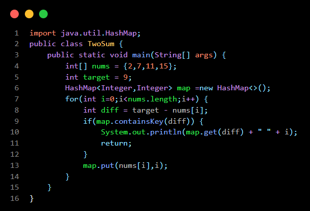
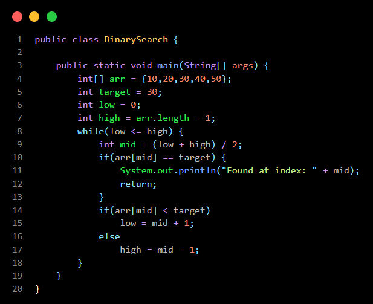
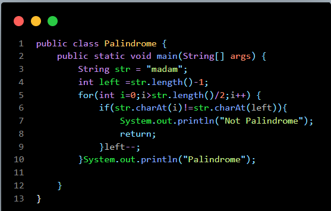
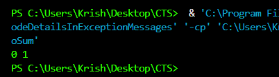
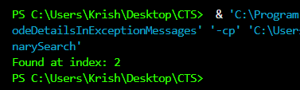
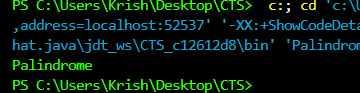

# Day 3 - Data Structures & Algorithms

## What is DSA?

DSA stands for Data Structures and Algorithms.

Data Structure:
A way of organizing data efficiently.

Examples:
- Array
- Linked List
- Stack
- Queue
- HashMap

Algorithm:
A step-by-step procedure to solve a problem.

Examples:
- Binary Search
- Sorting
- BFS
- DFS

## Important DSA Concepts

### Array
Stores elements in contiguous memory locations.

### HashMap
Stores key-value pairs.

### Binary Search
Searches an element in a sorted array in O(log n).

### Two Pointers
Uses two indices to solve problems efficiently.

## Learning Outcome

- Learned HashMap usage.
- Implemented Two Sum.
- Implemented Binary Search.
- Implemented Palindrome Check.

# Code Snippet :

- ## Program 1 - Two Sum :

- ## Program 2 - Binary Search :

- ## Program 3 - Palindrome :

# Output :

- ## Program 1 - Two Sum :

- ## Program 2 - Binary Search :

- ## Program 3 - Palindrome :

