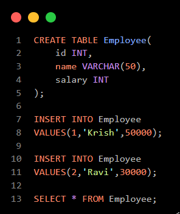
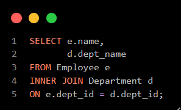
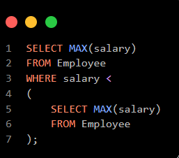
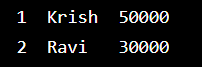
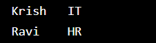
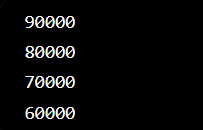

# Day 4 - SQL & PL/SQL

## What is SQL?

SQL (Structured Query Language) is used to store, retrieve, update and delete data from a database.

Common Commands:

1. SELECT
2. INSERT
3. UPDATE
4. DELETE
5. CREATE
6. DROP
7. TRUNCATE

## DDL Commands

DDL = Data Definition Language

Commands:

- CREATE
- ALTER
- DROP
- TRUNCATE

## DML Commands

DML = Data Manipulation Language

Commands:

- INSERT
- UPDATE
- DELETE

## Joins

1. INNER JOIN
2. LEFT JOIN
3. RIGHT JOIN
4. FULL JOIN

## Subqueries

A query inside another query is called a Subquery.

Example:
- Finding second highest salary.

## PL/SQL

PL/SQL stands for Procedural Language SQL.

Features:

- Variables
- Loops
- Conditions
- Procedures
- Functions

## Difference between DELETE, TRUNCATE and DROP?

| DELETE        | TRUNCATE          | DROP              |
| ------------- | ----------------- | ----------------- |
| Removes rows  | Removes all rows  | Removes table     |
| WHERE allowed | WHERE not allowed | Table deleted     |
| Can rollback  | Faster            | Structure removed |

# Learning Outcome

- Learned SQL commands.
- Practiced Joins.
- Practiced Subqueries.
- Understood PL/SQL basics.

# Code snippet :

- ## Program 1 - BasicQueries.sql :

- ## Program 2 - Joins.sql :

- ## Program 3 - Subqueries.sql : 

# Output :

- ## Program 1 - BasicQueries.sql :

- ## Program 2 - Joins.sql :

- ## Program 3 - Subqueries.sql :

