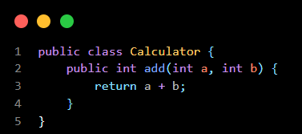
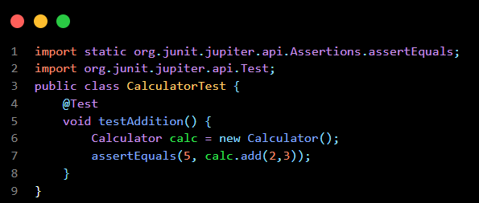

# Day 5 - Test Driven Development (TDD) & JUnit

## What is TDD?

TDD (Test Driven Development) is a software development approach where test cases are written before the actual code.

TDD Cycle:

1. Write Test Case
2. Run Test (Fail)
3. Write Code
4. Run Test (Pass)
5. Refactor Code

This process is called:

Red → Green → Refactor

## Advantages of TDD

- Better code quality
- Easier debugging
- Reduces bugs
- Improves maintainability
- Encourages modular code

## What is JUnit?

JUnit is a Java testing framework used to test Java applications automatically.

JUnit helps developers:

- Verify program correctness
- Detect bugs early
- Automate testing

## Common JUnit Annotations

@Test
@BeforeEach
@AfterEach

## Learning Outcome

- Learned TDD process
- Understood Red-Green-Refactor cycle
- Learned basic JUnit testing

# Code snippet :





## Example Test Case

### Production Code

Calculator.java contains:

- add(int a, int b)

### Test Case

CalculatorTest.java contains:

```java
assertEquals(5, calc.add(2,3));
Example input:
2 + 3

Expected Output:
5

Test Status:
PASS