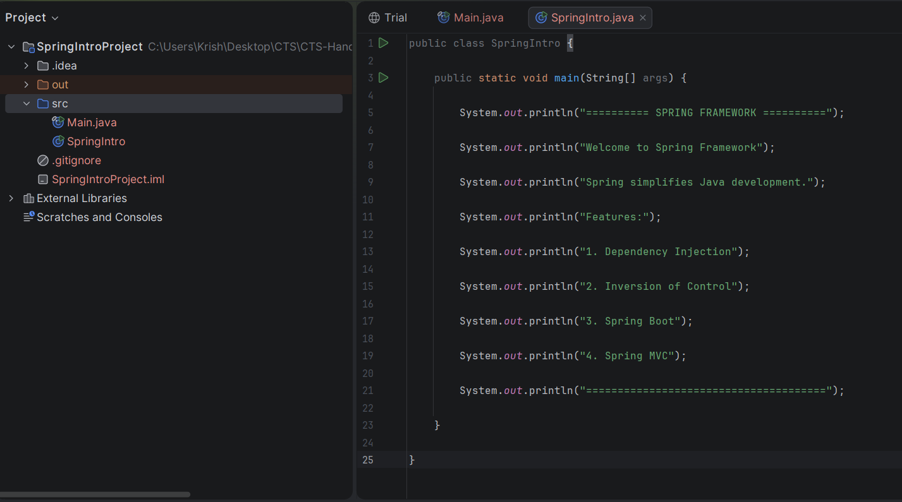
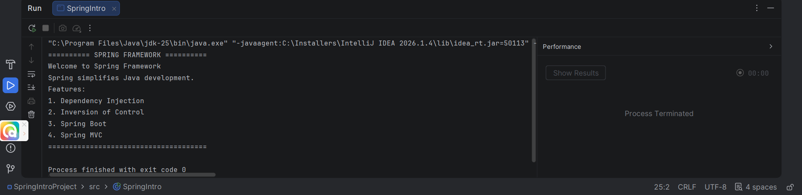

# Day 1 - Introduction to Spring Framework

## Objective

To understand the basics of the Spring Framework, its architecture, advantages, and why it is widely used for enterprise application development.

---

# What is Spring?

Spring is an open-source Java framework developed to simplify enterprise application development. It provides comprehensive infrastructure support for developing Java applications.

Spring manages object creation, dependency injection, transaction management, security, web development, and database integration.

---

# Why Spring?

Without Spring:
- Objects are created manually.
- Applications become tightly coupled.
- Testing becomes difficult.
- Code becomes harder to maintain.

With Spring:
- Objects are managed automatically.
- Loose coupling is achieved.
- Dependency Injection simplifies development.
- Easier testing and maintenance.

---

# Features of Spring

- Lightweight
- Open Source
- Dependency Injection (DI)
- Inversion of Control (IoC)
- Aspect Oriented Programming (AOP)
- Spring MVC
- Spring Boot
- Spring Data JPA
- Spring Security

---

# Spring Modules

- Spring Core
- Spring Context
- Spring Beans
- Spring MVC
- Spring AOP
- Spring JDBC
- Spring ORM
- Spring Boot
- Spring Security

---

# Advantages

- Loose Coupling
- Reusable Components
- Easy Testing
- Faster Development
- Production Ready
- Large Community Support

---

# Real World Applications

- Banking Systems
- E-commerce Applications
- Hospital Management Systems
- ERP Systems
- Inventory Management
- Cloud Applications

---

# Interview Questions

## What is Spring Framework?

Spring is an open-source Java framework used for developing enterprise applications.

---

## What is the main purpose of Spring?

To simplify Java application development by providing Dependency Injection and Inversion of Control.

---

## Difference between Java and Spring?

Core Java focuses on programming fundamentals.

Spring provides infrastructure for building scalable enterprise applications.

---

## Learning Outcome

✔ Learned Spring basics

✔ Understood why Spring is popular

✔ Learned Spring modules

✔ Understood enterprise application development

# Code snippet :

# Output :

