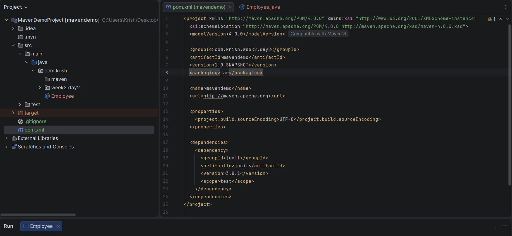
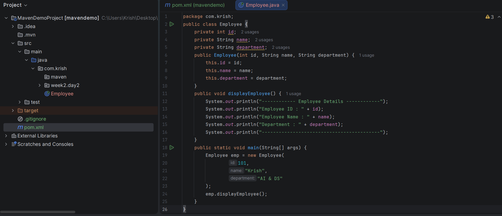
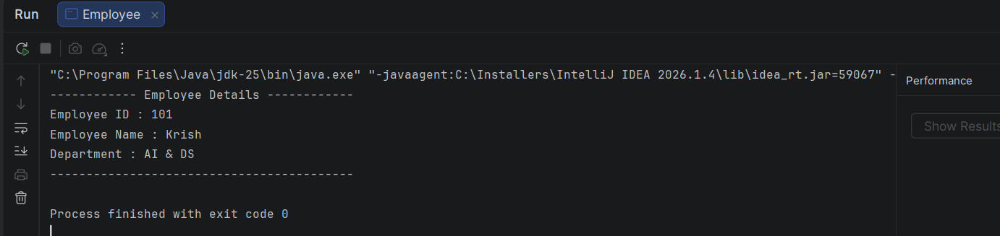

# Day 2 - Maven

## Objective

To understand Maven, its project structure, dependency management, lifecycle, and how it simplifies Java project development.

---

# What is Maven?

Maven is a Build Automation and Project Management tool used for Java projects.

It helps developers:

- Compile code
- Download libraries automatically
- Run tests
- Package applications
- Manage project dependencies

---

# Why Maven?

Without Maven:

- Libraries are downloaded manually.
- Dependency versions become difficult to manage.
- Project structure differs from developer to developer.

With Maven:

- Standard project structure
- Automatic dependency management
- Easy project build
- Faster development

---

# Features of Maven

- Dependency Management
- Build Automation
- Project Standardization
- Plugin Support
- Easy Testing
- Packaging (JAR/WAR)

---

# Maven Project Structure

project-name/

src/

main/

java/

resources/

test/

pom.xml

---

# What is pom.xml?

POM stands for Project Object Model.

It contains:

- Project Information
- Dependencies
- Plugins
- Java Version
- Build Configuration

Example:

```xml
<groupId>com.example</groupId>
<artifactId>MavenDemo</artifactId>
<version>1.0.0</version>
```

---

# Maven Lifecycle

1. validate
2. compile
3. test
4. package
5. verify
6. install
7. deploy

---

# Common Maven Commands

Create Project

mvn archetype:generate

Compile

mvn compile

Run Tests

mvn test

Create JAR

mvn package

Install

mvn install

---

# Advantages

- Automatic dependency download
- Standard project structure
- Faster builds
- Easier maintenance
- Widely used in enterprise applications

---

# Interview Questions

### What is Maven?

Maven is a build automation and dependency management tool for Java projects.

---

### What is pom.xml?

It is the Project Object Model file that stores project configuration.

---

### Why Maven is used?

To automate build, testing, packaging, and dependency management.

---

### What are Dependencies?

External libraries required by a project.

Example:

Spring Boot

Hibernate

JUnit

MySQL Connector

---

# Learning Outcome

✔ Learned Maven

✔ Understood pom.xml

✔ Learned Maven lifecycle

✔ Learned Maven commands

✔ Understood dependency management

# Pom.xml :



# Code snippet :



# Output :

