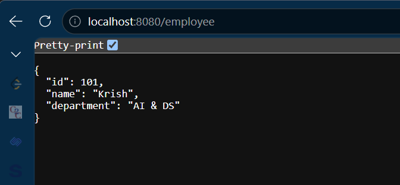
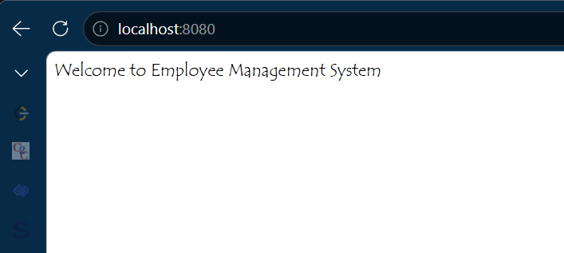
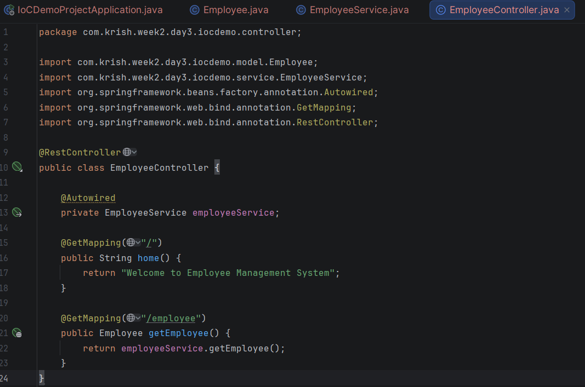
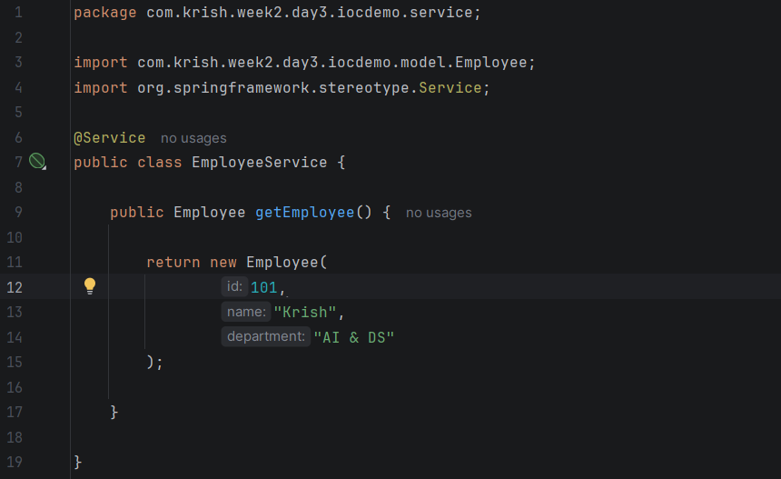
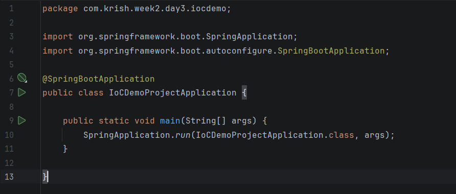

# Day 3 - Spring IoC & Dependency Injection

## Objective

To understand Inversion of Control (IoC) and Dependency Injection (DI), which are the core concepts of the Spring Framework.

---

# What is Inversion of Control (IoC)?

Inversion of Control is a principle where the control of creating and managing objects is transferred from the programmer to the Spring Container.

Without IoC:

The programmer creates objects manually.

With IoC:

Spring creates, manages, and injects objects automatically.

---

# What is Dependency Injection (DI)?

Dependency Injection is a technique where one object receives another object instead of creating it itself.

Instead of:

EmployeeService service = new EmployeeService();

Spring injects the EmployeeService object automatically.

---

# Types of Dependency Injection

1. Constructor Injection
2. Setter Injection
3. Field Injection

Constructor Injection is the most recommended approach.

---

# Advantages

- Loose Coupling
- Easier Testing
- Better Code Reusability
- Easy Maintenance
- Scalable Applications

---

# Real World Example

A Car needs an Engine.

Without DI:

Car creates its own Engine.

With DI:

Spring provides the Engine object to the Car.

---

# Interview Questions

### What is IoC?

IoC means transferring the control of object creation and management to the Spring Container.

---

### What is Dependency Injection?

Dependency Injection is the process of providing required objects to another object instead of creating them manually.

---

### Why Constructor Injection is preferred?

Because it makes objects immutable and easier to test.

---

# Learning Outcome

✔ Learned IoC

✔ Learned Dependency Injection

✔ Learned Constructor Injection

✔ Understood Loose Coupling

# Output :

# Code Snippets :
# 1

# 2

# 3

# 4
