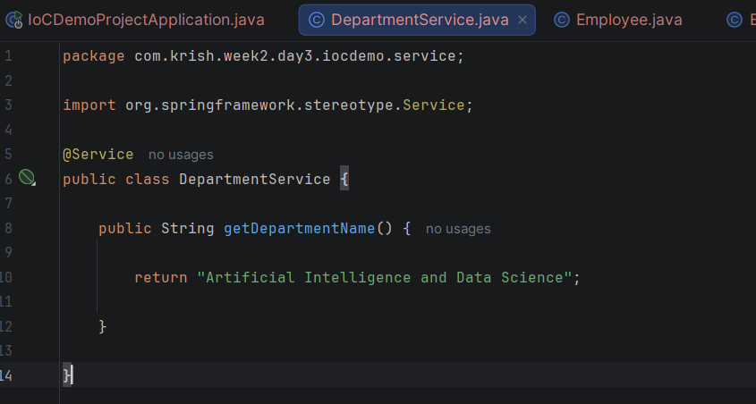
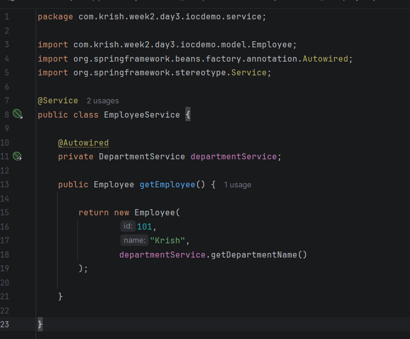
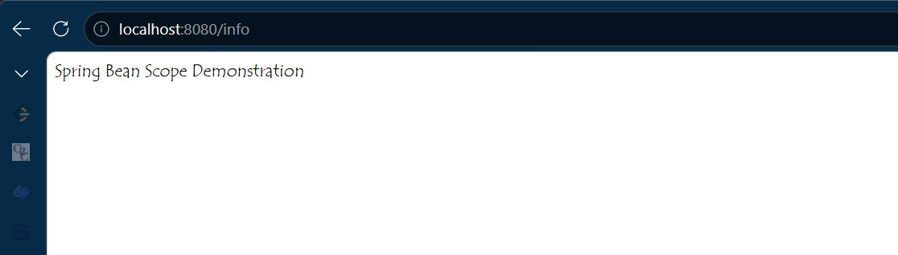
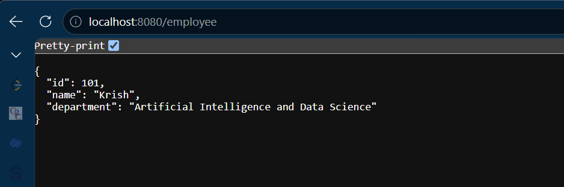

# Week 2 - Day 4

> ## Project Continuation

This day's practical implementation extends the **Spring Boot project created in Week 2 - Day 3 (IoCDemoProject)**.

No new project was created for Day 4.

The existing project was enhanced by implementing:

- Spring Beans
- Bean Scope concepts
- DepartmentService Bean
- Dependency Injection between multiple Service classes
- Additional REST endpoint (/info)

The updated project files can be found in:

Week2_CTS-Program/
└── Day3_IoC_DI/
    └── IoCDemoProject/
    
## Topic

Spring Bean, Bean Scope and Dependency Injection

---

## What is a Spring Bean?

A Spring Bean is an object that is created, configured and managed by the Spring IoC Container.

Beans are created automatically when classes are annotated with annotations such as:

- @Component
- @Service
- @Repository
- @Controller
- @RestController

---

## Bean Scope

Spring provides different Bean Scopes.

### Singleton

Default scope.

Only one object is created.

Example:

EmployeeService

---

### Prototype

Creates a new object every time.

Example:

Shopping Cart

---

### Request

One object per HTTP Request.

---

### Session

One object per User Session.

---

## Dependency Injection

Instead of creating objects using

```java
new EmployeeService();
```

Spring automatically injects the required object using

```java
@Autowired
```

---

## Practical Activity

- Created DepartmentService Bean.
- Injected DepartmentService into EmployeeService.
- Demonstrated Bean-to-Bean communication.
- Executed multiple REST endpoints.
- Observed Spring creating and managing Bean objects.

---

## Interview Questions

### What is a Spring Bean?

An object managed by the Spring Container.

### What is Dependency Injection?

Providing required objects automatically instead of creating them manually.

### What is the default Bean Scope?

Singleton.

### Which annotation creates a Service Bean?

@Service

### Which annotation injects a Bean?

@Autowired

---

## Learning Outcome

✔ Understood Spring Bean

✔ Learned Bean Scope

✔ Implemented Dependency Injection

✔ Built multiple Service Beans

✔ Created multiple REST endpoints

# Code Snippets : 





# Output :



