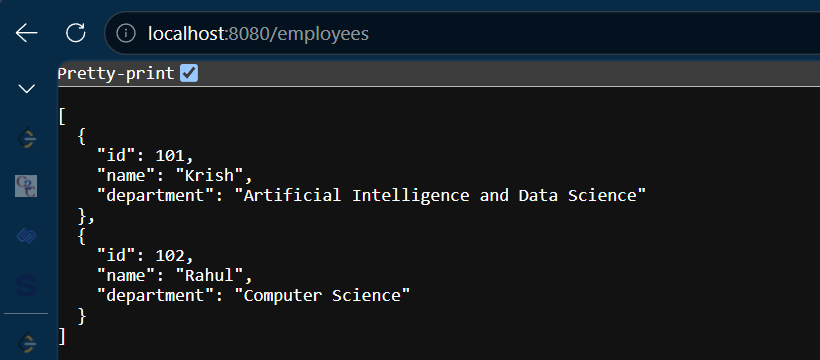

# Week 2 - Day 5

> ## Project Continuation

This day's work continues the **Spring Boot project created in Week 2 - Day 3**.

The same project was extended by implementing:

- REST API enhancements
- GET APIs
- POST API
- RequestBody
- Employee List
- In-memory data storage using ArrayList

The updated project is located in:

Week2_CTS-Program/
└── Day3_IoC_DI/
    └── IoCDemoProject/

## Topic

Spring Boot REST APIs

---

## Objective

To understand how Spring Boot handles HTTP requests using REST APIs.

---

## Annotations Used

### @RestController

Marks the class as a REST Controller.

---

### @GetMapping

Used to handle HTTP GET requests.

Example:

```java
@GetMapping("/employees")
```

---

### @PostMapping

Used to handle HTTP POST requests.

Example:

```java
@PostMapping("/employee")
```

---

### @RequestBody

Converts incoming JSON into a Java Object.

Example:

```java
public Employee addEmployee(@RequestBody Employee employee)
```

---

## Practical Activities

- Created multiple REST endpoints.
- Returned a list of employees.
- Added employee using POST request.
- Used ArrayList as temporary storage.
- Tested REST APIs successfully.

---

## Interview Questions

### What is REST API?

A REST API allows communication between client and server using HTTP methods.

### Difference between GET and POST?

GET retrieves data.

POST sends data to the server.

### What does @RequestBody do?

Converts JSON into a Java object.

### Why use @RestController?

To expose REST endpoints.

---

## Learning Outcome

✔ Created REST APIs

✔ Used GET and POST

✔ Returned JSON responses

✔ Worked with ArrayList

✔ Learned client-server communication

# Output

