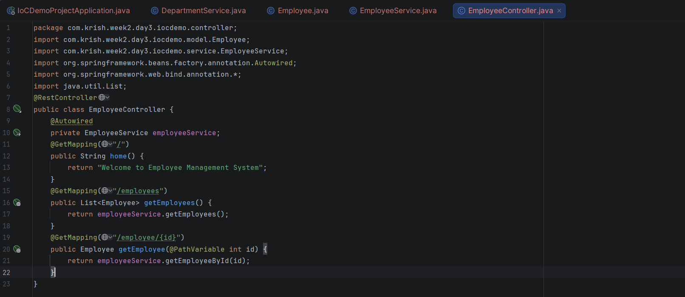
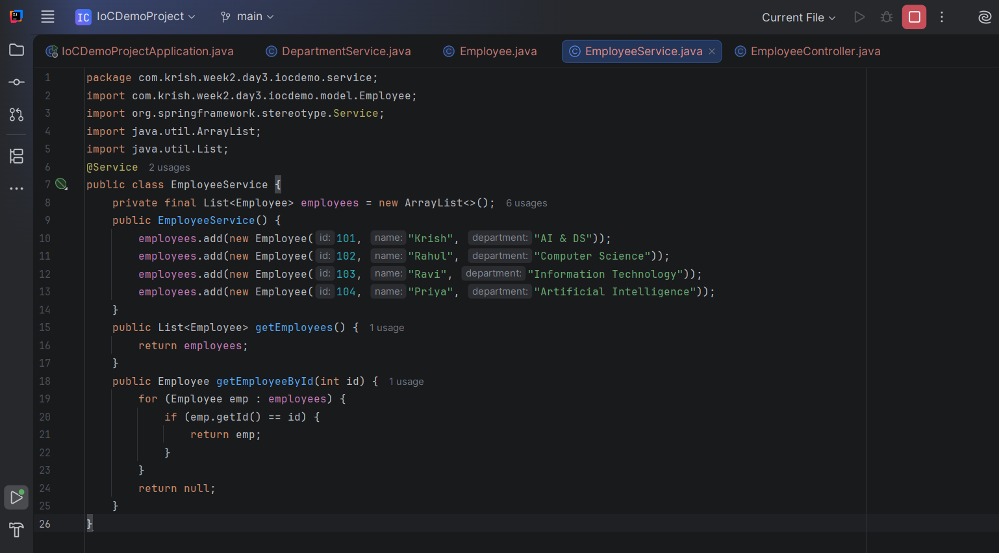
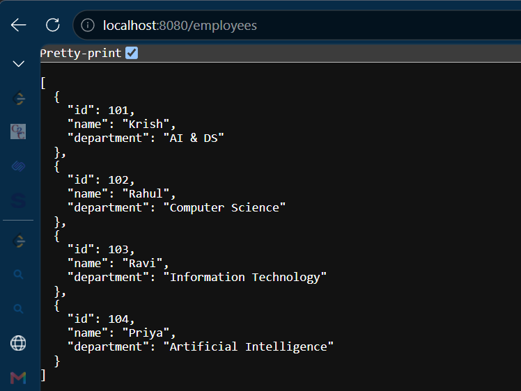
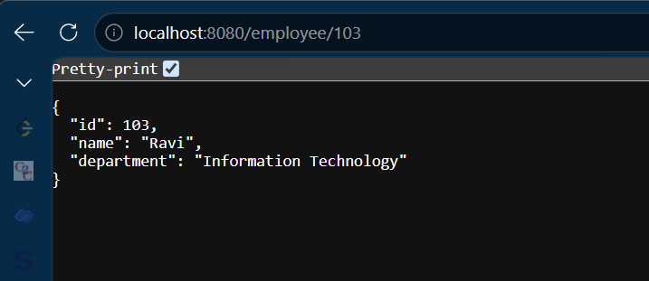

# Week 3 - Day 1

## Topic

Spring REST using Spring Boot - CRUD Read Operations

---

## Project Status

**Project Type:** Existing Project (Continued)

**Base Project:** Week 2 → Day 3 → IoCDemoProject

### Reason

Instead of creating a new Spring Boot project, the existing Employee Management application has been extended by adding CRUD Read operations. This follows the real-world software development approach where applications evolve by adding new features incrementally.

---

## Objective

To understand RESTful CRUD architecture and implement employee retrieval using Spring Boot.

---

## CRUD Operations

Create → POST

Read → GET

Update → PUT

Delete → DELETE

---

## HTTP Methods

GET

Retrieves data.

POST

Creates new data.

PUT

Updates existing data.

DELETE

Deletes existing data.

---

## REST Endpoints

GET /

Home Page

GET /employees

Returns all employees.

GET /employee/{id}

Returns a specific employee.

---

## Path Variable

A Path Variable allows values to be passed directly in the URL.

Example

GET /employee/101

Here,

101 is the Path Variable.

Spring captures it using

@PathVariable

---

## Advantages

- Cleaner URLs
- Easy Resource Identification
- REST Standard
- Easy Client Integration

---

## Practical Activities

- Extended previous Spring Boot project
- Implemented Path Variable
- Retrieved employee by ID
- Returned JSON response
- Built CRUD Read APIs

---

## Interview Questions

### What is REST?

REST is an architectural style used to build web services using HTTP methods.

---

### What is CRUD?

CRUD stands for Create, Read, Update and Delete.

---

### What is @PathVariable?

@PathVariable extracts values directly from the URL.

---

### Difference between @PathVariable and @RequestParam?

@PathVariable

Value comes from URL path.

@RequestParam

Value comes from query string.

---

## Learning Outcome

✔ Understood CRUD

✔ Learned REST architecture

✔ Implemented Path Variables

✔ Built Employee Search API

✔ Extended an existing Spring Boot project
# Code Snippets :

# Output :

