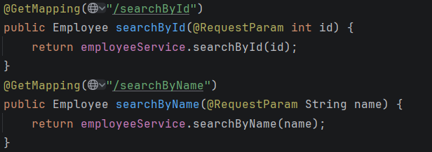
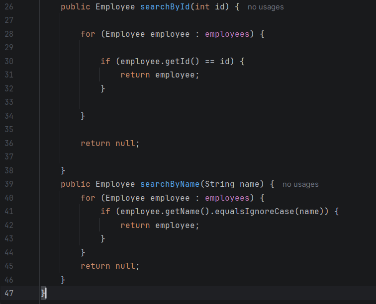
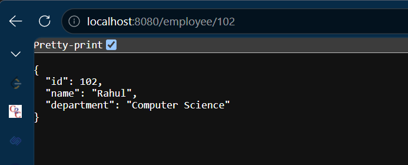

# Week 3 - Day 2

## Topic

Spring REST - Request Parameters & Employee Search

---

## Project Status

**Project Type:** Existing Project (Continued)

**Base Project:** Week 2 → Day 3 → IoCDemoProject

### Reason

This day's work extends the existing Employee Management Spring Boot application. Instead of creating a new project, additional search functionality is implemented using Request Parameters.

---

## Objective

To understand Request Parameters and implement employee search functionality.

---

## What is @RequestParam?

@RequestParam is used to read values from the URL query string.

Example

GET /search?id=101

Here,

id is obtained using @RequestParam.

---

## Difference

@PathVariable

Example

/employee/101

@RequestParam

Example

/search?id=101

---

## Advantages

- Easy filtering
- Searching
- Sorting
- Pagination
- Optional parameters

---

## Practical Activities

- Implemented search using employee id.
- Implemented search using employee name.
- Learned Request Parameters.
- Compared PathVariable and RequestParam.

---

## Interview Questions

### What is @RequestParam?

Used to receive values from the query string.

### Difference between @PathVariable and @RequestParam?

@PathVariable

Reads value from URL path.

@RequestParam

Reads value from query string.

### Can RequestParam be optional?

Yes.

---

## Learning Outcome

✔ Learned Request Parameters

✔ Implemented Employee Search

✔ Compared PathVariable and RequestParam

✔ Extended Spring Boot Project

# Code Snippets :

# Output :

