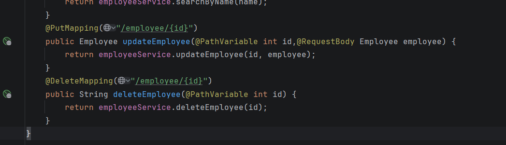
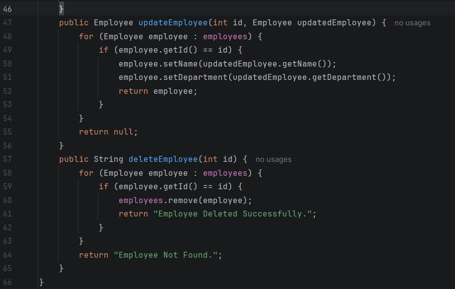
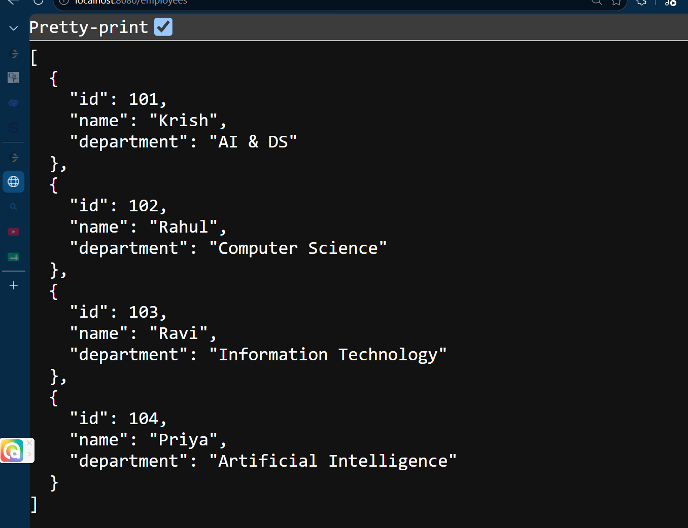
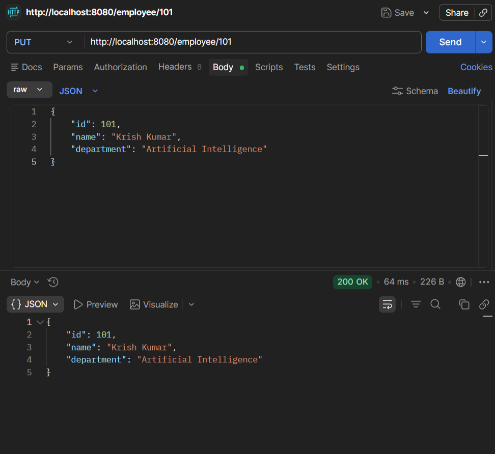

# Week 3 - Day 3

## Topic

Spring REST - Update & Delete Operations

---

## Project Status

**Project Type:** Existing Project (Continued)

**Base Project:** Week 2 → Day 3 → IoCDemoProject

### Reason

The Employee Management Spring Boot project is extended by implementing Update and Delete operations using HTTP PUT and DELETE methods.

---

## Objective

To understand PUT and DELETE operations in RESTful APIs.

---

## HTTP Methods Used

GET → Read

POST → Create

PUT → Update

DELETE → Delete

---

## @PutMapping

Used to update existing resources.

Example

PUT /employee/101

---

## @DeleteMapping

Used to delete existing resources.

Example

DELETE /employee/101

---

## Practical Activities

- Updated employee details.
- Deleted employee by ID.
- Tested PUT and DELETE APIs.
- Verified changes using GET API.

---

## Interview Questions

### What is @PutMapping?

Used to update existing resources.

### What is @DeleteMapping?

Used to delete resources.

### Difference between POST and PUT?

POST creates a new resource.

PUT updates an existing resource.

---

## Learning Outcome

✔ Learned PUT Mapping

✔ Learned DELETE Mapping

✔ Implemented Update API

✔ Implemented Delete API

✔ Completed CRUD Operations

# Code Snippets :

# Output :

