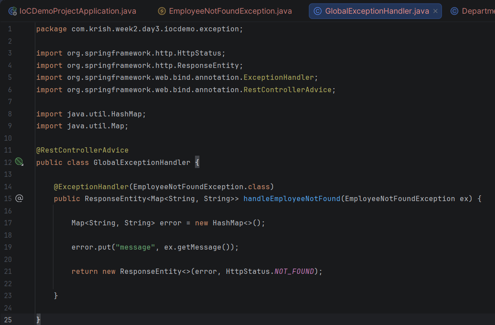
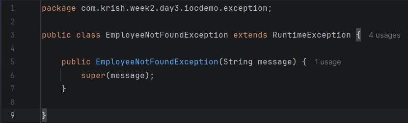
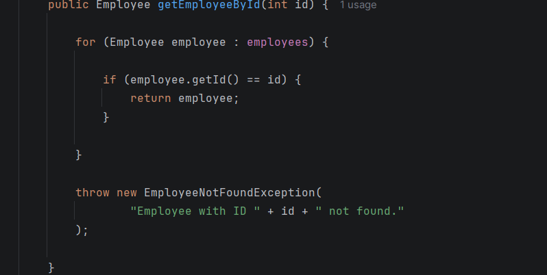
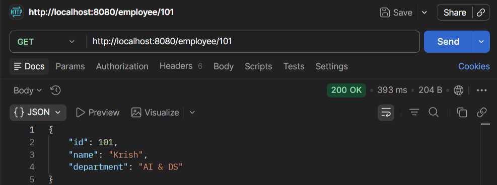
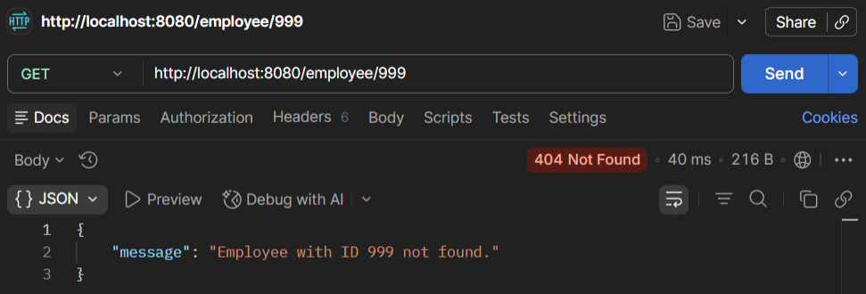

# Week 3 - Day 4

## Topic

Global Exception Handling in Spring Boot

---

## Project Status

**Project Type:** Existing Project (Continued)

**Base Project:** Week 2 → Day 3 → IoCDemoProject

### Reason

This day's work continues the Employee Management Spring Boot application created in Week 2 Day 3. The project is enhanced by implementing custom exception handling to provide meaningful error responses instead of returning null values.

---

## What is Exception Handling?

Exception Handling is the process of handling runtime errors gracefully without crashing the application.

---

## What is a Custom Exception?

A Custom Exception is a user-defined exception created to represent application-specific errors.

Example:

EmployeeNotFoundException

---

## What is @RestControllerAdvice?

@RestControllerAdvice provides centralized exception handling for all REST controllers.

Instead of writing try-catch blocks in every controller, exceptions are handled in one place.

---

## What is @ExceptionHandler?

@ExceptionHandler specifies which exception should be handled.

Example

@ExceptionHandler(EmployeeNotFoundException.class)

---

## Advantages

- Cleaner Controller code
- Centralized Error Handling
- Easy Maintenance
- Professional REST API responses

---

## Practical Activities

- Created custom exception.
- Implemented global exception handler.
- Returned HTTP 404 response.
- Displayed meaningful error message.

---

## Interview Questions

### Why do we use Exception Handling?

To handle runtime errors gracefully.

---

### What is RuntimeException?

An unchecked exception that occurs during program execution.

---

### Why use @RestControllerAdvice?

To handle exceptions globally.

---

### What is @ExceptionHandler?

It maps an exception to a specific handler method.

---

## Learning Outcome

✔ Created Custom Exception

✔ Learned Global Exception Handling

✔ Used @RestControllerAdvice

✔ Used @ExceptionHandler

✔ Built Professional REST APIs

# Code Snippets :

# Output :

