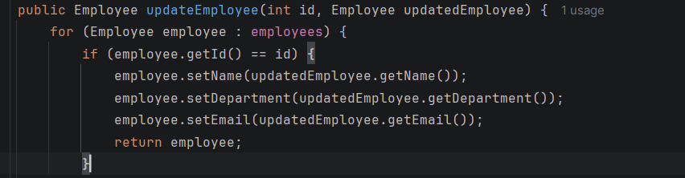
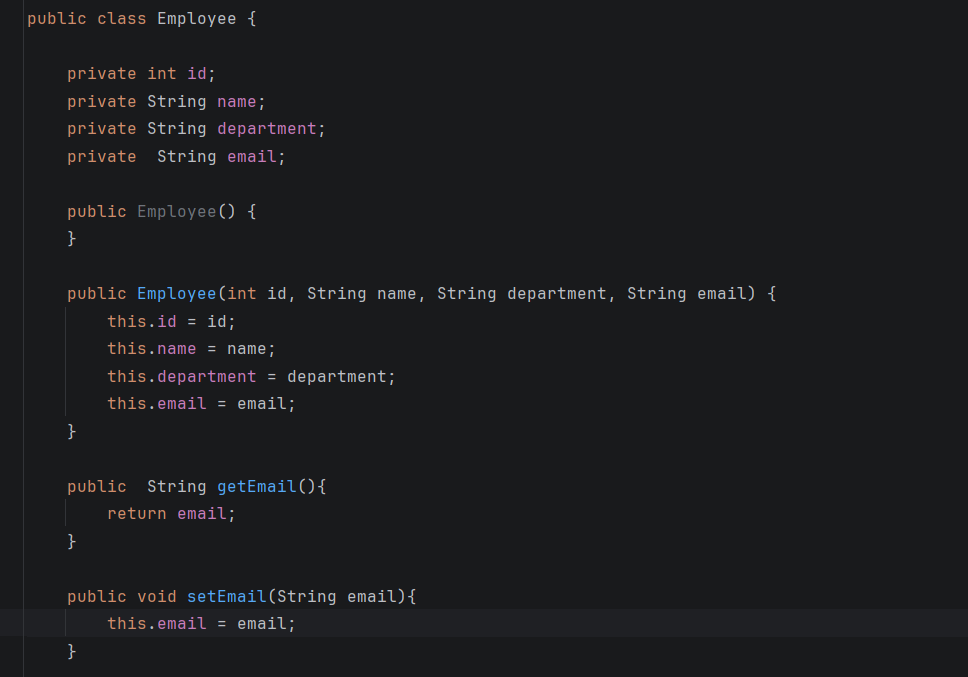

# Week 3 - Day 5

## Topic

Mini Employee Management REST API

---

## Project Status

**Project Type:** Existing Project (Continued)

**Base Project:** Week 2 → Day 3 → IoCDemoProject

### Reason

The Employee Management Spring Boot application developed in previous days is finalized into a mini REST API project. All previously learned concepts are integrated into a single application.

---

## Objective

To combine all REST concepts learned during Week 3 into one complete application.

---

## Features Implemented

- Home API
- View All Employees
- Search Employee by ID
- Search Employee by Name
- Add Employee
- Update Employee
- Delete Employee
- Global Exception Handling

---

## REST Endpoints

GET /

GET /employees

GET /employee/{id}

GET /searchById?id=101

GET /searchByName?name=Krish

POST /employee

PUT /employee/{id}

DELETE /employee/{id}

---

## Technologies Used

- Java 17
- Spring Boot 3
- Maven
- IntelliJ IDEA
- REST API
- JSON

---

## Practical Activities

- Integrated all APIs into one application.
- Tested CRUD operations.
- Implemented exception handling.
- Verified all endpoints.

---

## Interview Questions

### What is a REST API?

A REST API is a web service that allows communication between client and server using HTTP methods.

---

### What are CRUD operations?

Create

Read

Update

Delete

---

### Why is Exception Handling important?

It provides meaningful error messages and prevents application crashes.

---

### Why do we use Spring Boot?

Spring Boot simplifies Java application development by reducing configuration and providing embedded servers.

---

## Learning Outcome

✔ Built a complete Employee Management REST API

✔ Integrated all Spring Boot concepts

✔ Tested all endpoints

✔ Understood project structure

✔ Ready for advanced Spring Boot topics

# Code Snippets :

