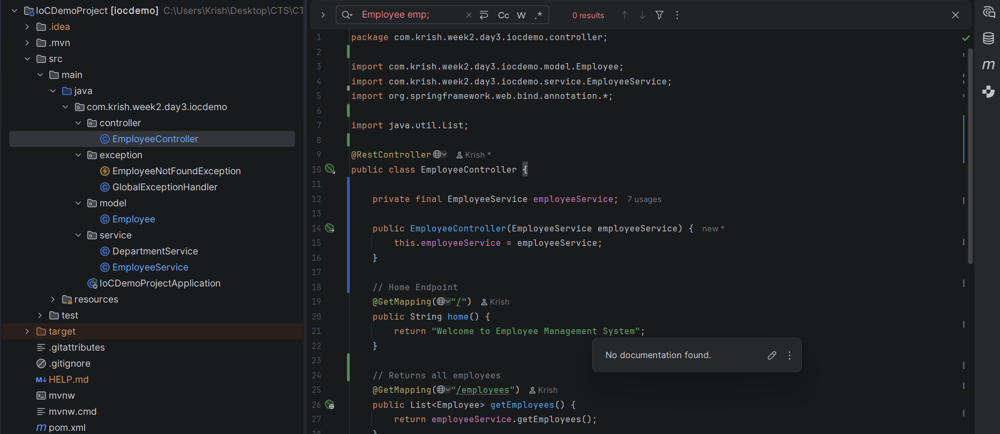
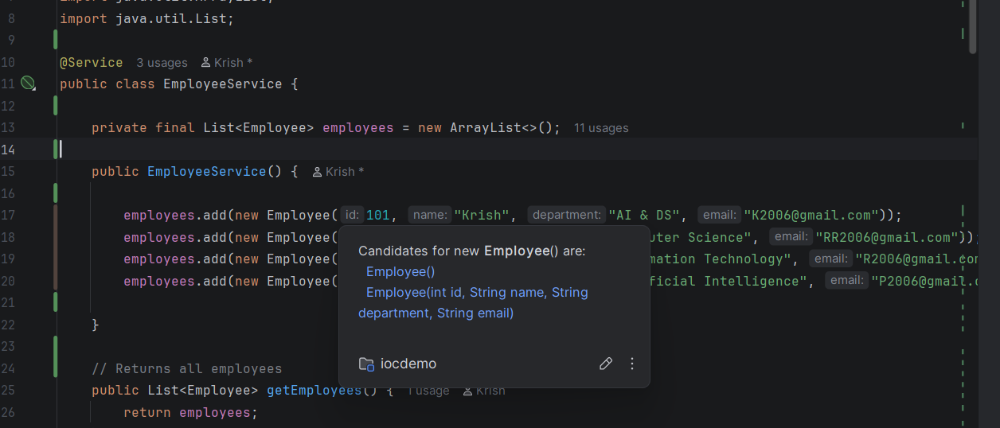

# Week 4 - Day 1

## Topic

Code Quality and Clean Coding Principles

---

## Project Status

**Project Type:** Existing Project (Continued)

**Base Project:** Week 2 → Day 3 → IoCDemoProject

### Reason

The Employee Management Spring Boot project is further improved by applying clean coding practices and refactoring techniques. Instead of adding new functionality, the focus is on making the existing code easier to read, maintain, and extend.

---

## Objective

To understand code quality, clean coding practices, and basic refactoring techniques.

---

## What is Code Quality?

Code Quality refers to how readable, maintainable, reusable, and reliable a software application is.

High-quality code should be:

- Easy to read
- Easy to modify
- Easy to test
- Easy to maintain

---

## Clean Coding Principles

- Meaningful Class Names
- Meaningful Method Names
- Avoid Duplicate Code
- Single Responsibility Principle
- Proper Indentation
- Consistent Formatting

---

## Refactoring

Refactoring means improving the internal structure of code without changing its external behavior.

---

## Practical Activities

- Improved method names.
- Improved variable names.
- Removed duplicate code.
- Added comments where required.
- Organized project structure.

---

## Interview Questions

### What is Code Quality?

Code Quality measures how maintainable, readable, and reliable the code is.

---

### What is Refactoring?

Improving existing code without changing functionality.

---

### Why is Clean Code important?

It improves maintainability and reduces bugs.

---

## Learning Outcome

✔ Learned Clean Coding Principles

✔ Improved Project Structure

✔ Applied Refactoring

✔ Understood Code Quality

## Code Snippets :

