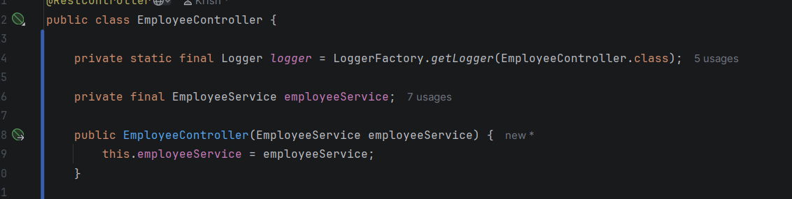
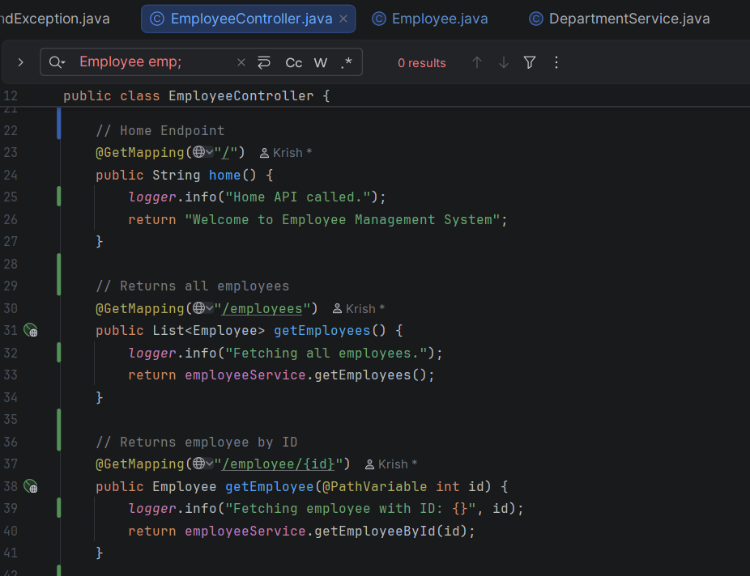
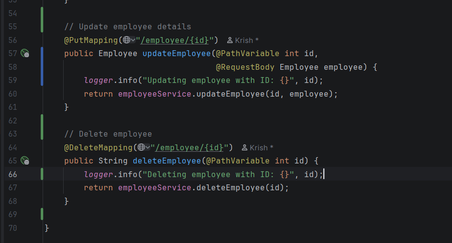
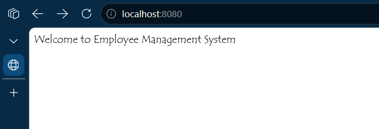
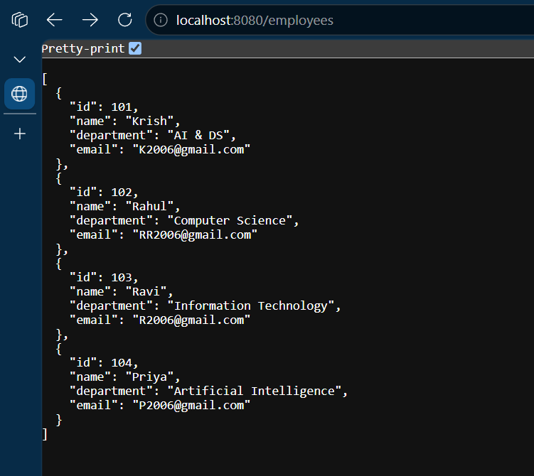
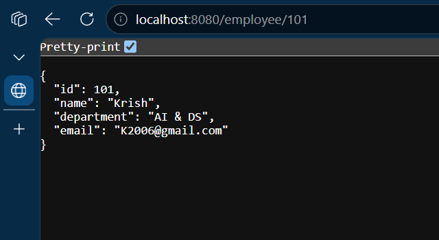
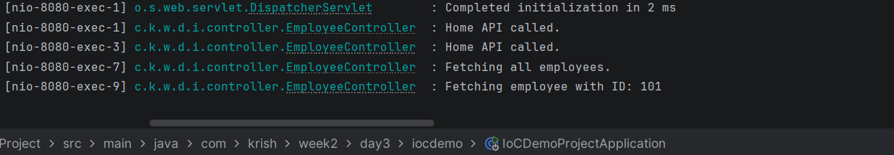

# Week 4 - Day 2

## Topic

Logging Framework using SLF4J and Logback

---

## Project Status

**Project Type:** Existing Project (Continued)

**Base Project:** Week 2 → Day 3 → IoCDemoProject

### Reason

The Employee Management Spring Boot project is enhanced by implementing logging using the SLF4J API and Logback framework. Logging helps developers monitor application execution, debug issues, and maintain software effectively.

---

## Objective

To understand the importance of logging and implement log messages in a Spring Boot REST application.

---

## What is Logging?

Logging is the process of recording application events during execution.

It helps developers:

- Debug applications
- Monitor execution
- Detect errors
- Analyze application behavior

---

## What is SLF4J?

SLF4J (Simple Logging Facade for Java) is a logging API used by Spring Boot.

---

## What is Logback?

Logback is the default logging framework used by Spring Boot.

---

## Log Levels

TRACE

DEBUG

INFO

WARN

ERROR

---

## Practical Activities

- Configured Logger.
- Logged API requests.
- Logged successful operations.
- Logged application events.

---

## Interview Questions

### Why do we use Logging?

Logging helps monitor and debug applications.

### What is SLF4J?

A logging facade used by Spring Boot.

### Which logging framework is used by Spring Boot?

Logback.

### Which log level is most commonly used?

INFO.

---

## Learning Outcome

✔ Learned Logging

✔ Implemented Logger

✔ Used INFO Log Level

✔ Improved Project Monitoring

## Code Snippets :

## Output :

