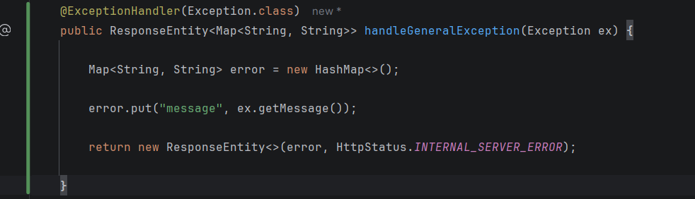
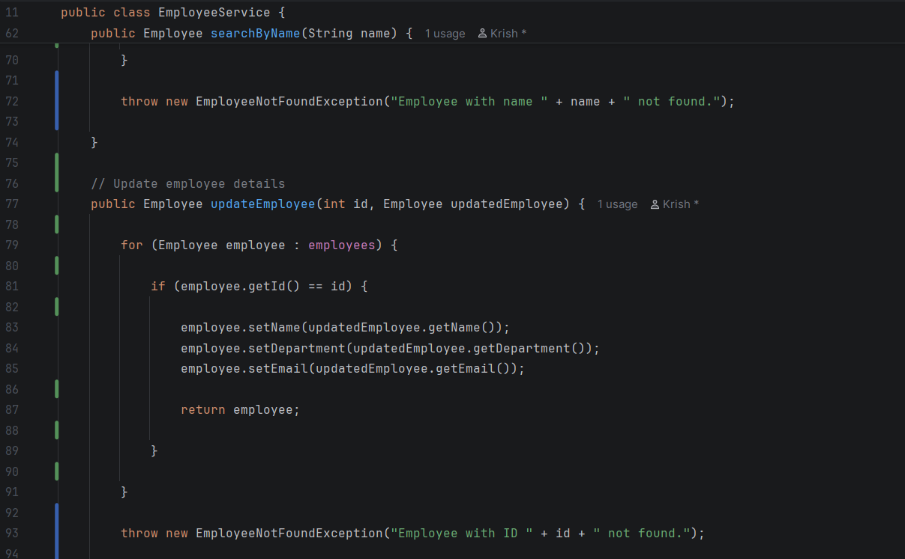
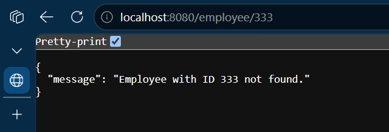
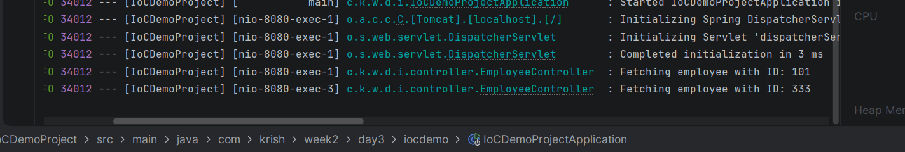

# Week 4 - Day 3

## Topic

Code Quality Analysis using SonarQube

---

## Project Status

**Project Type:** Existing Project (Continued)

**Base Project:** Week 2 → Day 3 → IoCDemoProject

### Reason

The Employee Management Spring Boot project is reviewed using SonarQube concepts. The project is refactored by applying clean coding practices and improving maintainability.

---

## Objective

To understand SonarQube and improve code quality using industry best practices.

---

## What is SonarQube?

SonarQube is a static code analysis tool used to inspect source code for quality issues before deployment.

It detects:

- Bugs
- Code Smells
- Security Vulnerabilities
- Duplicate Code
- Poor Coding Practices

---

## Benefits of SonarQube

- Improves code quality
- Reduces technical debt
- Detects bugs early
- Encourages clean coding
- Improves maintainability

---

## Common Code Smells

- Duplicate Code
- Long Methods
- Poor Variable Names
- Unused Imports
- Dead Code
- Magic Numbers

---

## Practical Activities

- Reviewed project structure.
- Improved formatting.
- Removed unnecessary imports.
- Improved naming conventions.
- Applied constructor injection.
- Organized methods.

---

## Interview Questions

### What is SonarQube?

SonarQube is a static code analysis platform used to inspect and improve code quality.

---

### What is a Code Smell?

A Code Smell is a sign of poor code design that may reduce maintainability.

---

### Does SonarQube execute code?

No.

It analyzes source code without executing it.

---

### What is Technical Debt?

The future cost of fixing poor-quality code.

---

## Learning Outcome

✔ Learned SonarQube

✔ Understood Code Smells

✔ Improved Code Quality

✔ Applied Industry Coding Standards

## Code Snippets :

## Output :

