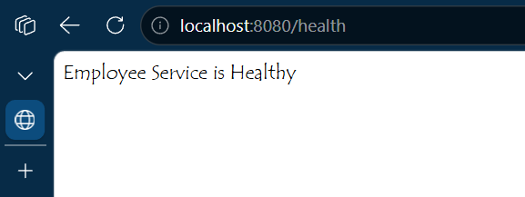
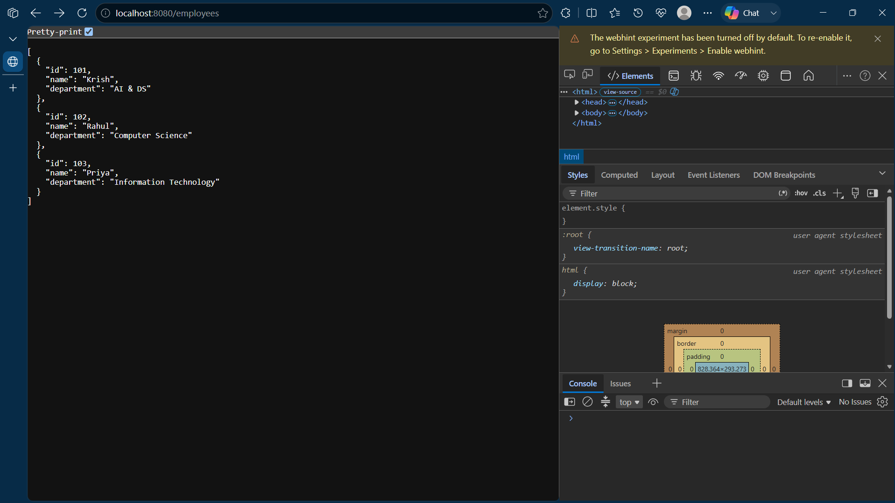
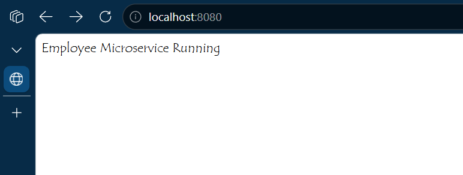
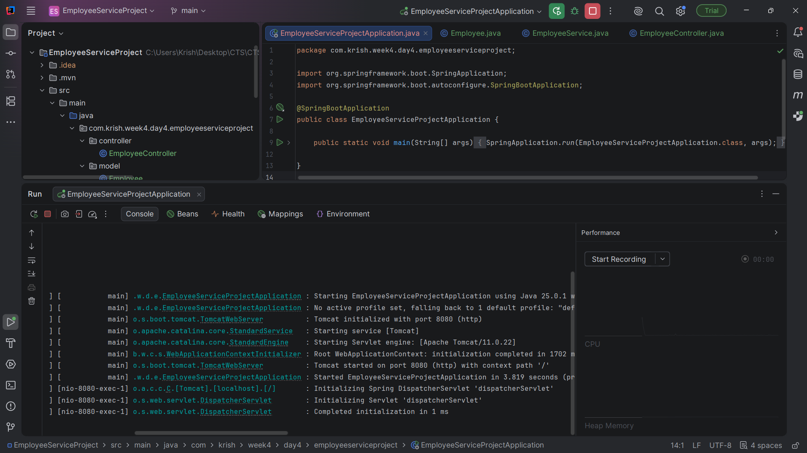
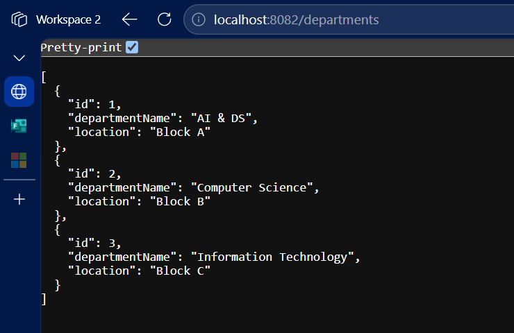
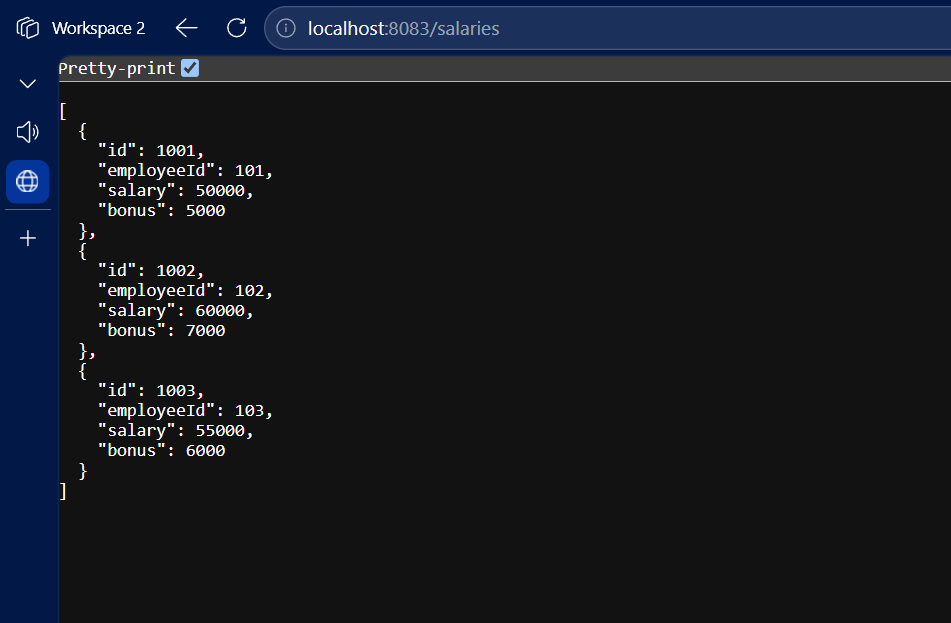
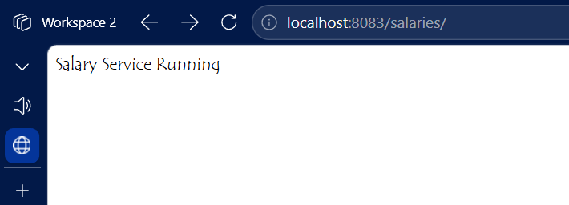
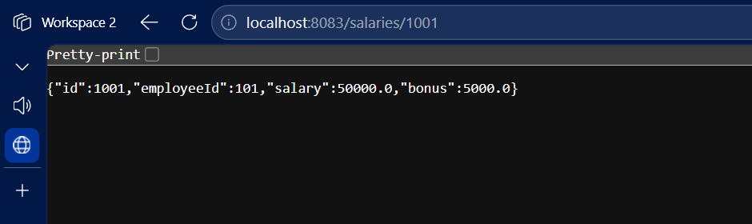

# Week 4 - Day 4

## Topic

Building a Microservices Architecture using Spring Boot

---

## Project Status

Project Type : New Projects

Projects Created

- Employee Service
- Department Service
- Salary Service

---

## Objective

To understand how a monolithic application can be divided into multiple independent microservices.

---

## Microservices

Microservices is an architectural style in which a large application is divided into multiple small independent services.

Each service

- has its own project
- has its own business logic
- runs independently
- communicates using REST APIs

---

## Projects Developed

Employee Service

Runs on Port 8081

Department Service

Runs on Port 8082

Salary Service

Runs on Port 8083

---

## Advantages

- Independent Deployment
- Better Scalability
- Fault Isolation
- Easy Maintenance
- Independent Development

---

## Practical Activities

- Created three Spring Boot projects.
- Configured different server ports.
- Developed independent REST APIs.
- Tested all services separately.

---

## Learning Outcome

✔ Understood Microservices

✔ Created Multiple Spring Boot Services

✔ Configured Different Ports

✔ Built Independent REST APIs

## Architecture

                    Client

                      │

        ┌─────────────┼─────────────┐

        ▼             ▼             ▼

 Employee Service  Department Service  Salary Service

      8081             8082              8083

## Output :

- Employee Service

- Department Service 

- Salary Service 

