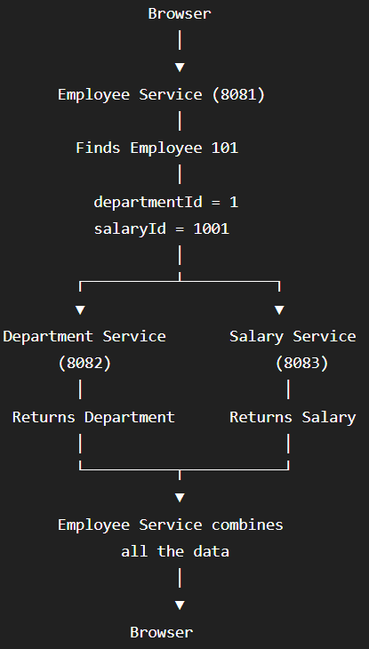
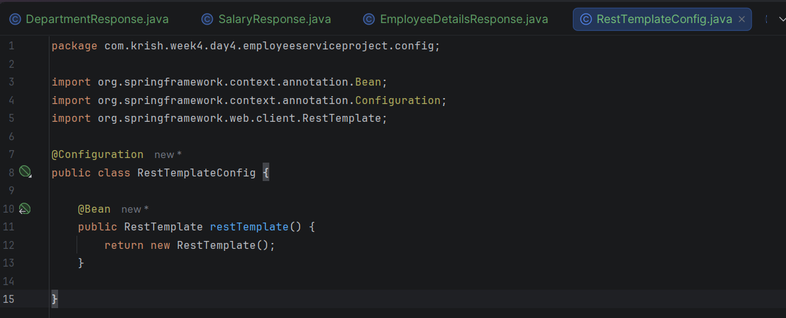

# Week 4 - Day 5

## Topic

Inter-Service Communication using RestTemplate

---

## Project Status

Project Type : Existing Microservices

Projects Used

- Employee Service
- Department Service
- Salary Service

---

## Objective

To enable communication between independent Spring Boot microservices.

---

## What is Inter-Service Communication?

Microservices rarely work alone.

One service communicates with another using REST APIs.

Example

Employee Service

↓

Department Service

↓

Salary Service

---

## RestTemplate

RestTemplate is a Spring class used to call REST APIs from another application.

---

## Architecture

Client

↓

Employee Service (8081)

↓

Department Service (8082)

↓

Salary Service (8083)

---

## Practical Activities

- Connected Employee Service with Department Service.
- Connected Employee Service with Salary Service.
- Returned combined employee information.

---

## Learning Outcome

✔ Understood Service Communication

✔ Used RestTemplate

✔ Connected Multiple Microservices

✔ Built Distributed Application

## Architecture

## Code Snippets :

## Output :

