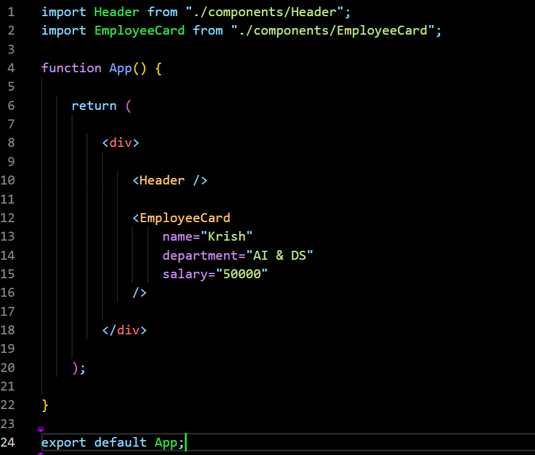
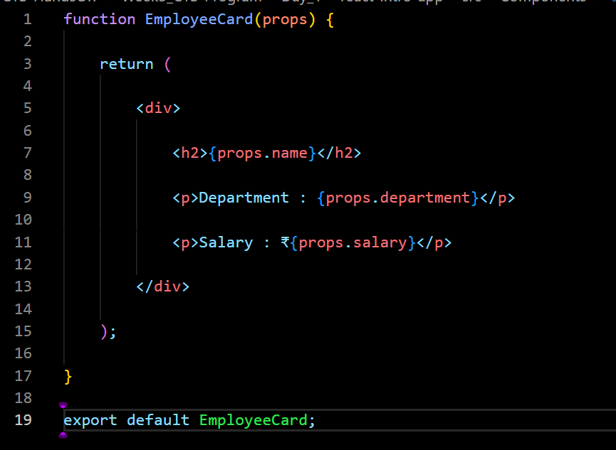
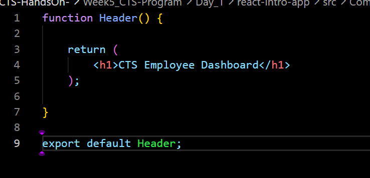
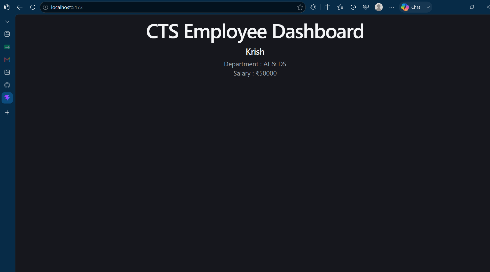

# Week 5 – Day 1

## Topic
Introduction to React

---

## Objectives

- Understand SPA (Single Page Application)
- Learn what React is
- Understand React Components
- Learn JSX
- Learn basic ES6 syntax used in React

---

## What is SPA?

SPA (Single Page Application) is a web application that loads only one HTML page and updates the content dynamically without refreshing the entire page.

Examples:
- Gmail
- Facebook
- Instagram
- Netflix

Benefits:
- Faster page loading
- Better user experience
- Reduced server requests

---

## What is React?

React is a JavaScript library developed by Facebook for building user interfaces.

Features:
- Component Based Architecture
- Virtual DOM
- Reusable Components
- Fast Rendering
- One-way Data Binding

---

## React Components

Components are reusable blocks of UI.

Types:
- Functional Components
- Class Components

In this course we use Functional Components.

---

## JSX

JSX stands for JavaScript XML.

It allows writing HTML inside JavaScript.

Example:

```jsx
<h1>Hello React</h1>
```

---

## ES6 Features Used

- import
- export
- const
- let
- Arrow Functions

---

## Files Created

App.jsx

Header.jsx

EmployeeCard.jsx

---

## Code Snippets 







## Output



---

## Conclusion

Learned the basics of React, Components, JSX and ES6.