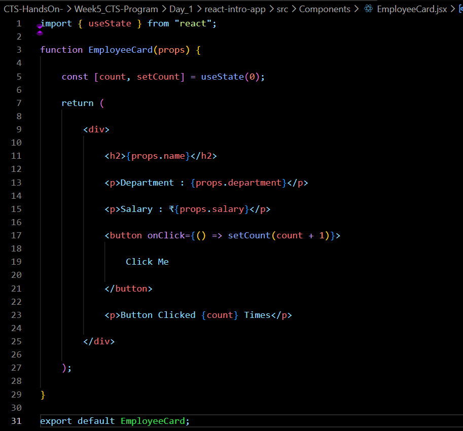
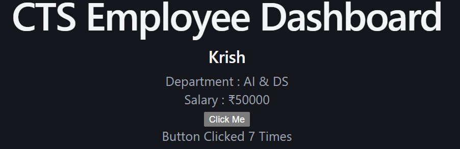

# Week 5 – Day 2

## Topics Covered

- Props
- React State
- useState Hook
- React Events
- Event Handling

---

## Props

Props are used to pass data from one component to another.

Example:

<EmployeeCard
name="Krish"
department="AI & DS"
/>

---

## State

State stores data that can change during the execution of the application.

React provides the useState Hook to create state variables.

Syntax:

const [count, setCount] = useState(0);

---

## React Events

React supports events similar to JavaScript.

Examples:

- onClick
- onChange
- onSubmit
- onMouseOver

---

## Files Modified

App.jsx

EmployeeCard.jsx

---

## Code Snippets 

## Output

---

## Conclusion

Learned Props, State Management using useState and Event Handling.