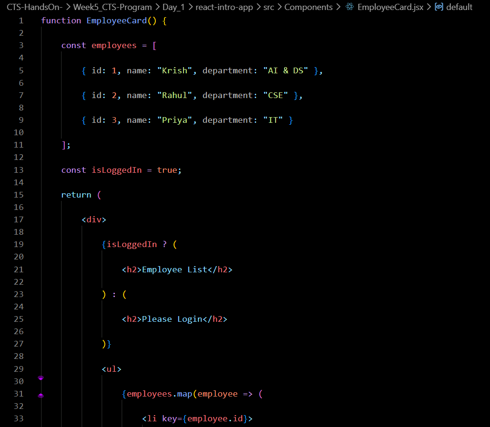

# Week 5 – Day 3

## Topics Covered

- Conditional Rendering
- React Lists
- React Keys

---

## Conditional Rendering

Conditional rendering is used to display different UI based on a condition.

Example:

```jsx
{isLoggedIn ? <h1>Welcome</h1> : <h1>Please Login</h1>}
```

---

## React Lists

Lists are displayed using the map() function.

Example:

```jsx
students.map(student => ...)
```

---

## Keys

Every item inside a list should have a unique key.

Example:

```jsx
<li key={student.id}>{student.name}</li>
```

---

## Files Modified

App.jsx

EmployeeCard.jsx

---

## Code Snippets 



## Output 


## Conclusion

Learned Conditional Rendering, Lists and Keys in React.