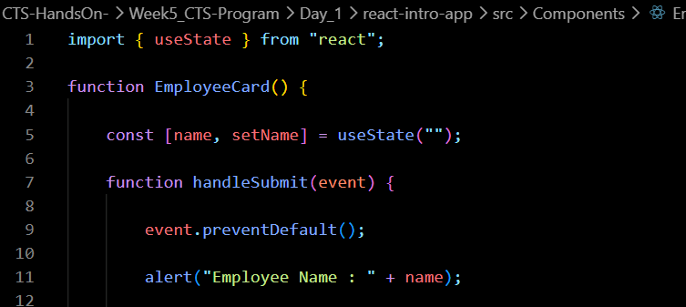
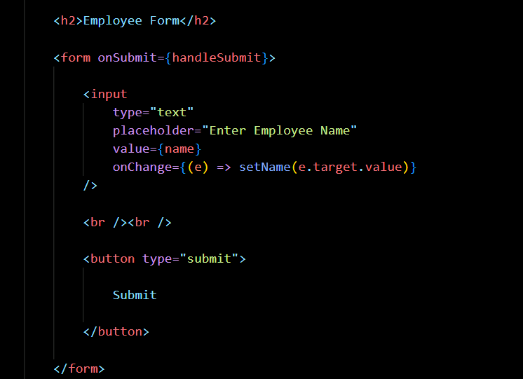
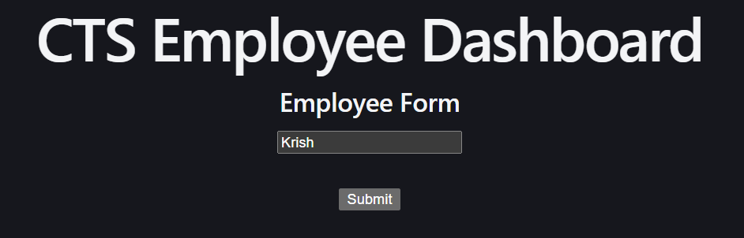
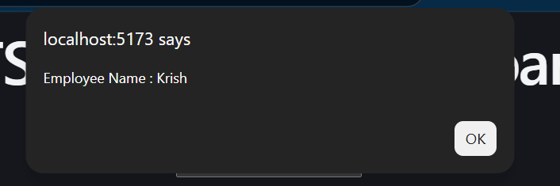

# Week 5 – Day 4

## Topics Covered

- React Forms
- Controlled Components
- useState with Forms
- onChange Event
- onSubmit Event

---

## React Forms

Forms are used to collect user input.

Examples:
- Textbox
- Dropdown
- Textarea

---

## Controlled Components

A controlled component stores the input value inside React State.

Example:

const [name, setName] = useState("");

---

## onChange

The onChange event updates the state whenever the user types.

Example:

onChange={(e) => setName(e.target.value)}

---

## onSubmit

The onSubmit event executes when the form is submitted.

Example:

<form onSubmit={handleSubmit}>

---

## Files Modified

App.jsx

EmployeeCard.jsx

---

## Code Snippets 

## Output 

## Conclusion

Learned React Forms using useState, onChange and onSubmit.