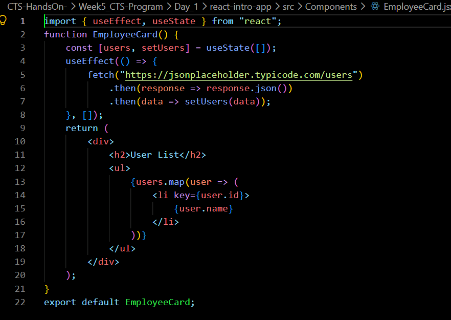
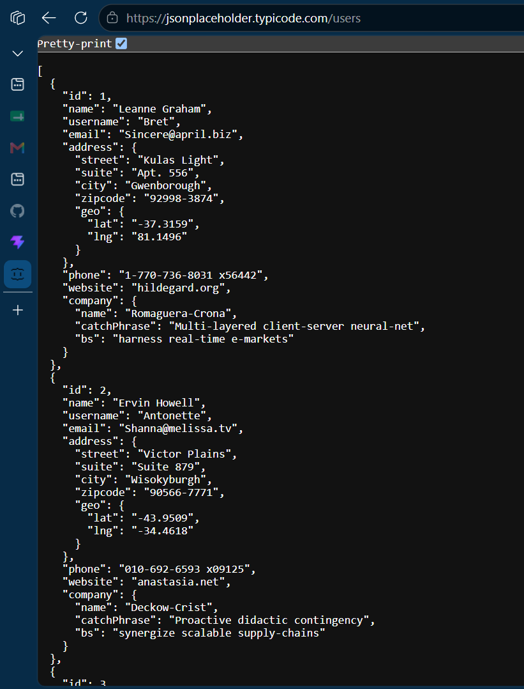
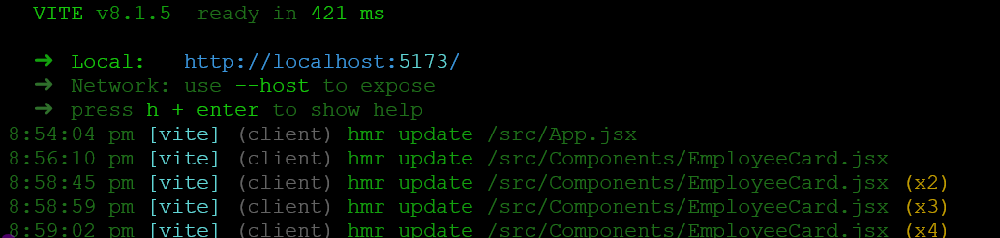

# Week 5 – Day 5

## Topics Covered

- Fetch API
- REST API Integration
- useEffect Hook
- Displaying API Data

---

## Fetch API

Fetch API is used to send HTTP requests and receive data from APIs.

Syntax:

fetch(url)
.then(response => response.json())
.then(data => console.log(data));

---

## useEffect Hook

The useEffect Hook executes code after the component renders.

Syntax:

useEffect(() => {

}, []);

---

## Why use Fetch?

- Read API data
- Connect frontend with backend
- Display dynamic information

---

## Files Modified

EmployeeCard.jsx

---

## Code Snippets 

## Output 

## Conclusion

Learned how to call REST APIs using Fetch API and display data in React.