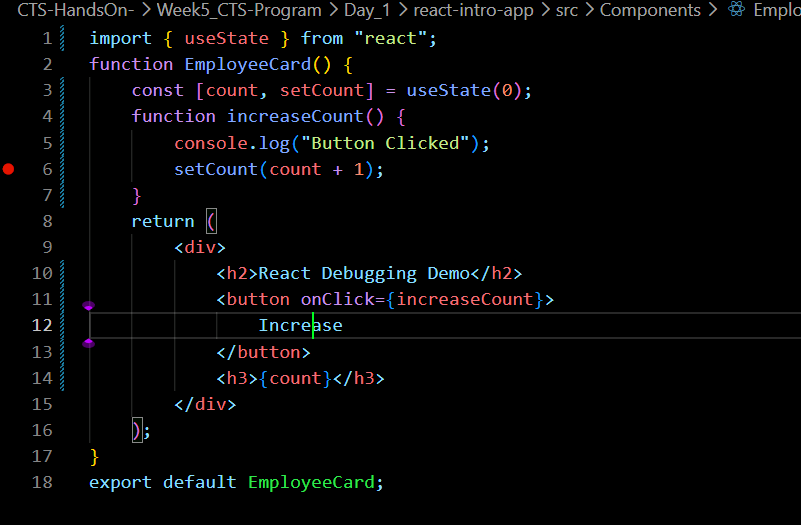
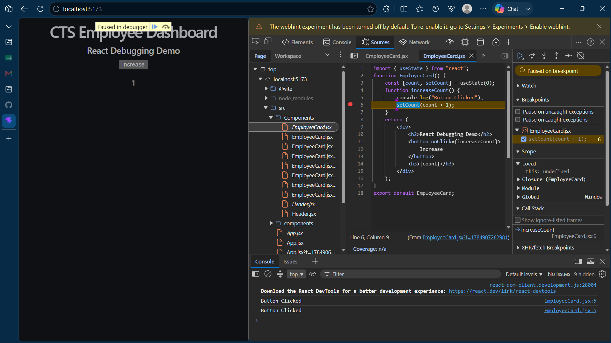

# Week 6 – Day 1

## Topics Covered

- Debugging React Applications
- Visual Studio Code Debugger
- Breakpoints
- Step Over
- Step Into
- Variables Inspection

---

## What is Debugging?

Debugging is the process of identifying and fixing errors in a program.

---

## Breakpoints

Breakpoints pause the execution of a program at a specific line.

Advantages:
- Check variable values
- Find logical errors
- Understand execution flow

---

## Debug Options

- Continue (F5)
- Step Over (F10)
- Step Into (F11)
- Step Out (Shift + F11)
- Restart
- Stop

---

## Variables Window

Displays the current values of variables while debugging.

---

## Code Snippet 

## Out 

## Conclusion

Learned how to debug React applications using Visual Studio Code.