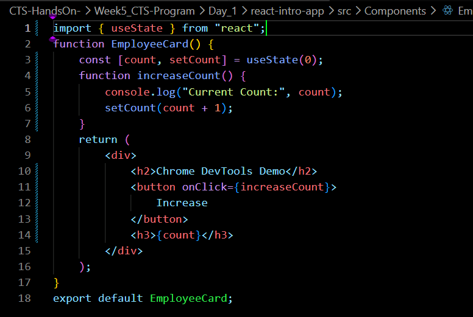
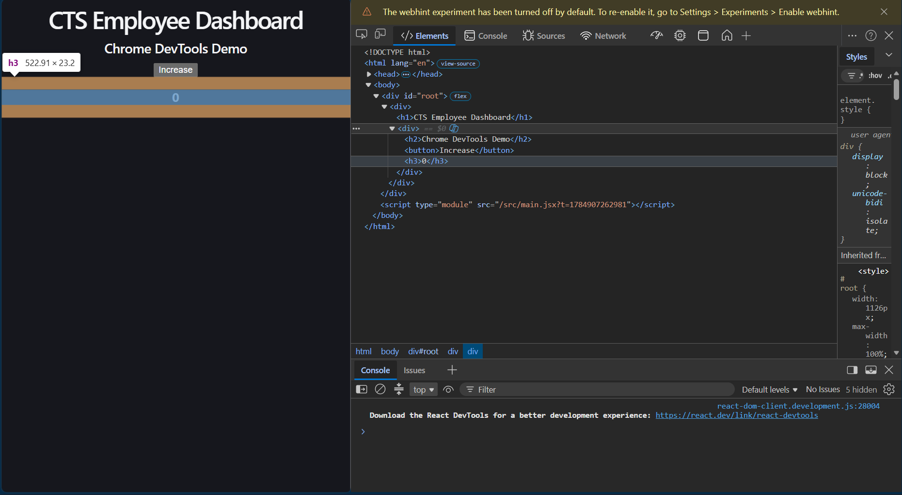
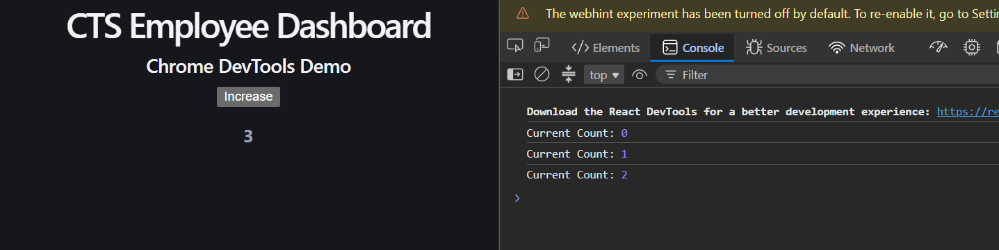
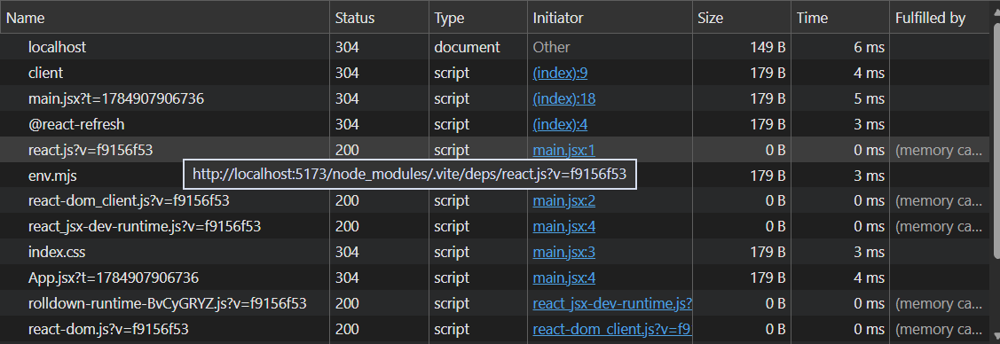

# Week 6 – Day 2

## Topics Covered

- Chrome DevTools
- Elements Panel
- Console
- Sources
- Network Tab

---

## Chrome DevTools

Chrome DevTools is a built-in browser tool used to inspect, debug and analyze web applications.

Shortcut:

F12

or

Ctrl + Shift + I

---

## Elements Panel

The Elements panel displays the HTML structure of the webpage.

It is used to:

- Inspect HTML
- Modify CSS
- View DOM elements

---

## Console

The Console displays:

- JavaScript logs
- Errors
- Warnings

Example:

console.log("Hello React");

---

## Sources

The Sources tab is used to:

- Set breakpoints
- Pause JavaScript execution
- Inspect variables
- Step through code

---

## Network Tab

The Network tab displays all HTTP requests made by the application.

It is useful for checking:

- API calls
- Request status
- Response time
- Failed requests

---
## Code Snippet 

## Out/Debugging views 

## Conclusion

Learned how to inspect webpages and debug React applications using Chrome DevTools.