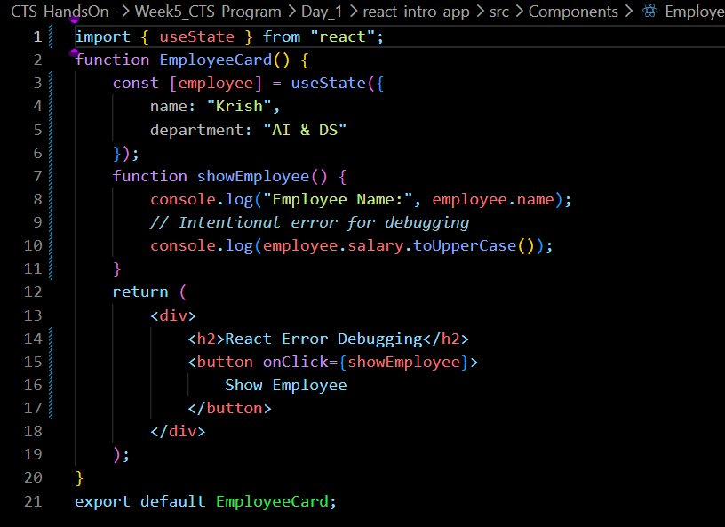
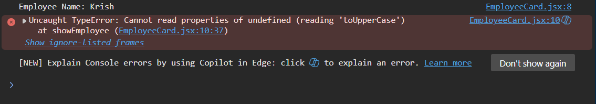
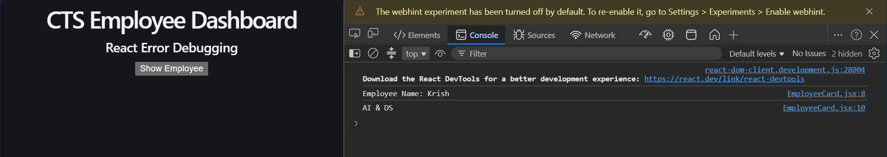

# Week 6 – Day 3

## Topics Covered

- Debugging JavaScript
- Debugging React Code
- Runtime Errors
- Console Errors
- Error Fixing

---

## JavaScript Errors

JavaScript errors occur due to syntax mistakes, undefined variables, or incorrect function calls.

Common Errors:
- ReferenceError
- TypeError
- SyntaxError

---

## React Runtime Errors

Runtime errors occur while the application is running.

Examples:
- Accessing undefined properties
- Calling functions incorrectly
- Rendering invalid data

---

## Using Chrome DevTools

Chrome DevTools helps to:
- View console errors
- Inspect stack traces
- Locate the exact line causing the error

---

## Debugging Process

1. Reproduce the error
2. Read the error message
3. Identify the source file
4. Fix the code
5. Verify the solution

---
## Code Snippet 

## Out/Debugging 

## Conclusion

Learned to identify and fix JavaScript and React runtime errors using Chrome DevTools.