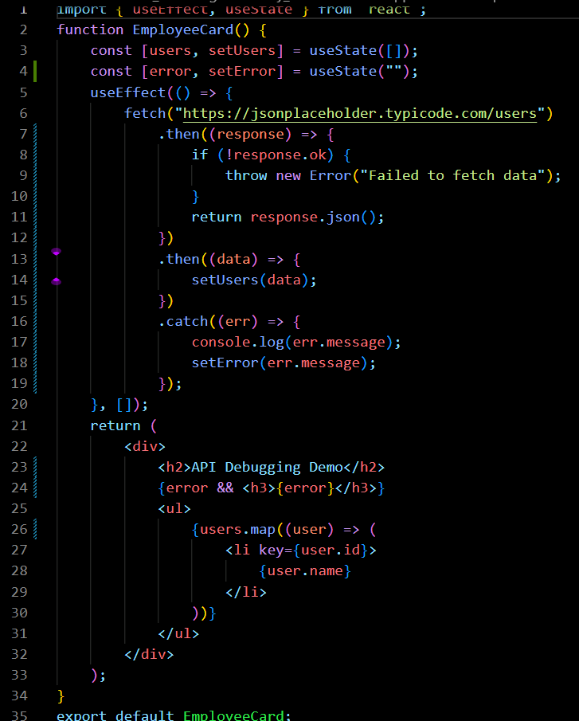
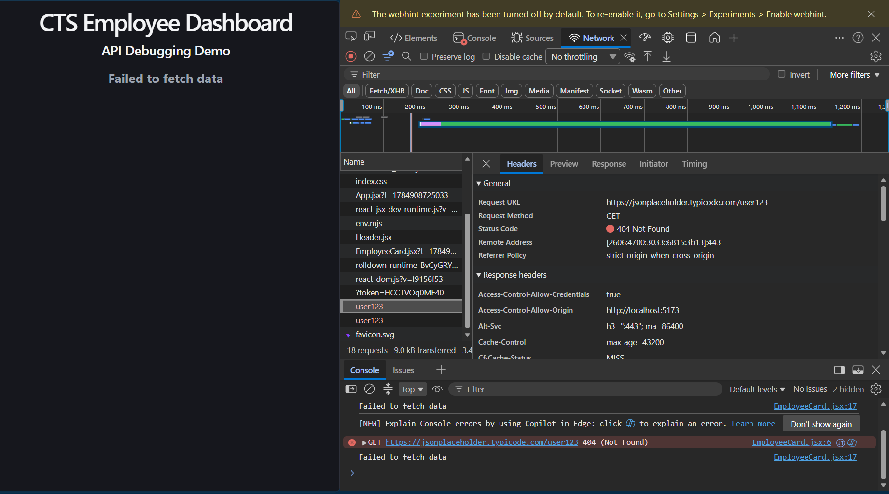
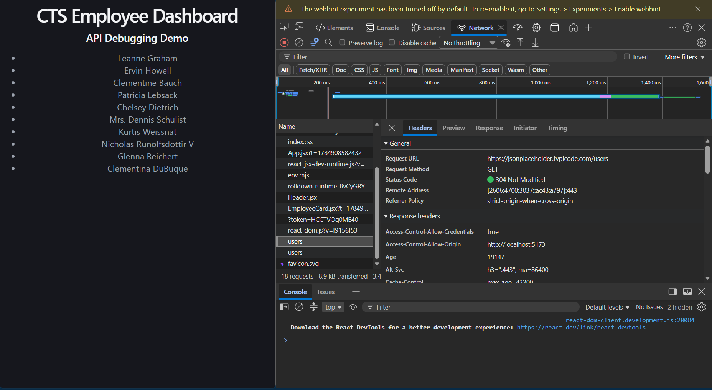

# Week 6 – Day 4

## Topics Covered

- Debugging API Calls
- Network Tab
- HTTP Status Codes
- Error Handling using Fetch

---

## API Debugging

API debugging is the process of checking whether requests are sent correctly and responses are received successfully.

---

## Network Tab

The Network tab displays:

- Request URL
- Request Method
- Status Code
- Response Body
- Response Headers
- Request Time

---

## Common HTTP Status Codes

200 - OK

201 - Created

400 - Bad Request

401 - Unauthorized

403 - Forbidden

404 - Not Found

500 - Internal Server Error

---

## Fetch Error Handling

Errors can be handled using:

try...catch

or

.catch()

---

## Code Snippet 

## Output/Debugging 

## Conclusion

Learned to debug REST API requests using Chrome DevTools Network tab.