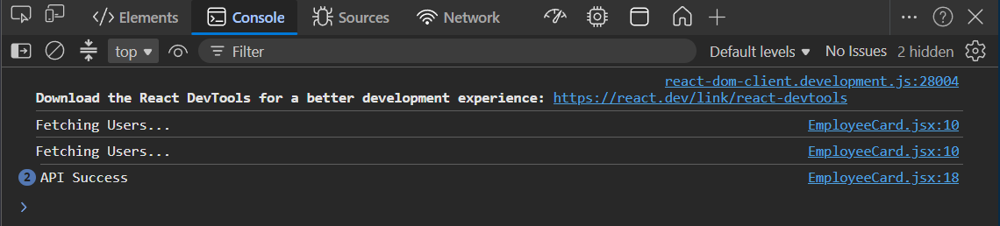
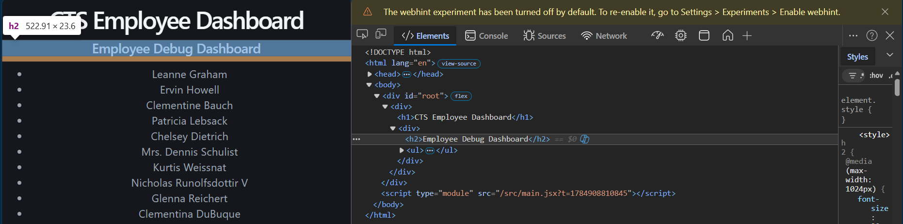
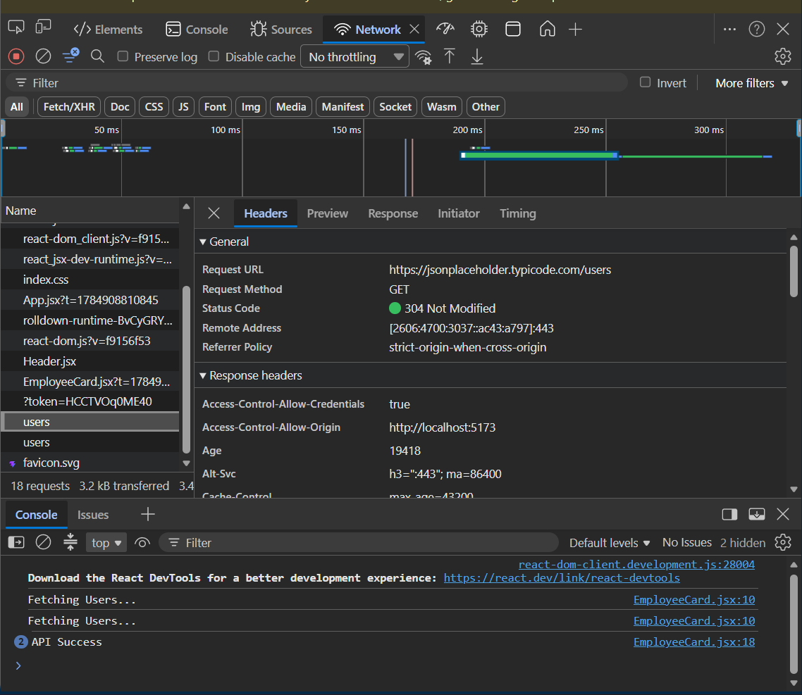
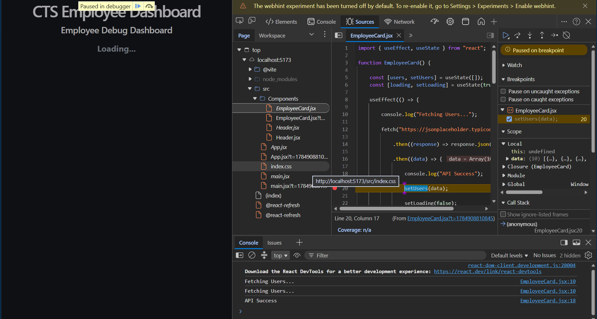

# Week 6 – Day 5

## Topics Covered

- React Debugging
- Chrome DevTools
- Console Logging
- Network Debugging
- Breakpoints
- State Debugging

---

## Debugging Workflow

1. Run the application.
2. Open Chrome DevTools.
3. Inspect Elements.
4. Check Console logs.
5. Verify API requests in Network.
6. Set breakpoints.
7. Inspect state variables.
8. Fix errors.
9. Test again.

---

## Tools Used

- Chrome DevTools
- React
- Fetch API
- Console
- Breakpoints

---

## Debugging Snippets

## Conclusion

Successfully applied debugging techniques to a React application.