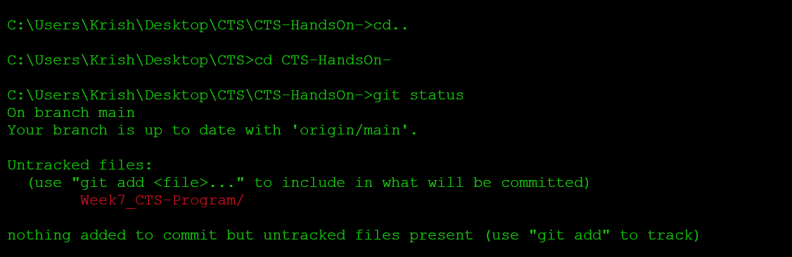
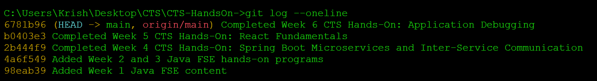
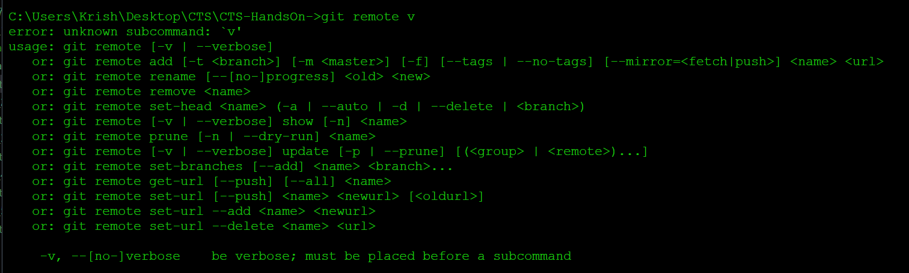

# Week 7 – Day 1

## Topics

- Version Control
- Git
- GitHub
- Repository
- Clone
- Commit
- Push

---

## Version Control

Version control helps track changes in a project and allows multiple developers to work together.

---

## Git

Git is a distributed version control system used to manage source code.

---

## GitHub

GitHub is a cloud platform used to host Git repositories.

---

## Repository

A repository (repo) stores the project files and their version history.

---

## Basic Git Commands

git init

git clone <repository-url>

git status

git add .

git commit -m "message"

git push origin main

---
## Output for Commands 

## Conclusion

Learned the basics of Git and version control.