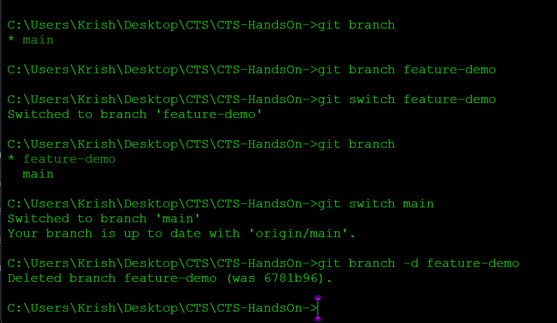

# Week 7 – Day 2

## Topics

- Branch
- Branch Creation
- Merge
- Merge Conflict
- Branching Strategy

---

## Branch

A branch is an independent line of development used to work on new features without affecting the main code.

---

## Merge

Merge combines changes from one branch into another.

---

## Merge Conflict

A merge conflict occurs when Git cannot automatically combine changes from two branches.

---

## Common Commands

git branch

git branch feature

git checkout feature

git switch feature

git merge feature

git branch -d feature

---
## Commands Usage 

## Conclusion

Learned Git branching and merging operations.