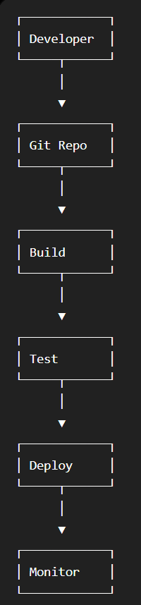

# Week 7 – Day 3

## Topics

- DevOps
- SDLC
- CI
- CD
- CI/CD Pipeline

---

## DevOps

DevOps is a culture that improves collaboration between Development and Operations teams to build, test and deploy software faster.

---

## SDLC

Software Development Life Cycle includes:

- Planning
- Design
- Development
- Testing
- Deployment
- Maintenance

---

## Continuous Integration (CI)

Developers frequently merge code into a shared repository where it is automatically built and tested.

---

## Continuous Delivery (CD)

The application is always ready for deployment after successful testing.

---

## CI/CD Pipeline

Code → Build → Test → Deploy → Monitor

---

## Benefits

- Faster delivery
- Better collaboration
- Reduced errors
- Automated testing
- Frequent releases

---

## Conclusion

Learned the basics of DevOps and the CI/CD workflow.