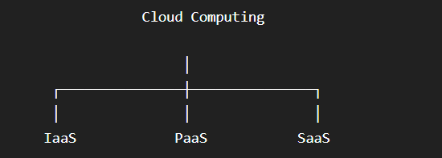

# Week 7 – Day 5

## Topics

- Cloud Computing
- Service Models
- Deployment Models
- GenAI
- LLM
- Prompt Engineering

---

## Cloud Computing

Cloud Computing is the delivery of computing services like servers, storage and databases over the internet.

---

## Service Models

### IaaS (Infrastructure as a Service)

Provides virtual machines, storage and networking.

Example: Amazon EC2

### PaaS (Platform as a Service)

Provides a platform to develop and deploy applications.

Example: Google App Engine

### SaaS (Software as a Service)

Provides software over the internet.

Example: Gmail, Microsoft 365

---

## Deployment Models

- Public Cloud
- Private Cloud
- Hybrid Cloud

---

## GenAI

Generative AI creates new content such as text, images, code and videos using AI models.

---

## LLM

Large Language Models (LLMs) are AI models trained on huge amounts of text to understand and generate human-like responses.

Examples:

- ChatGPT
- Gemini
- Claude

---

## Prompt Engineering

Prompt Engineering is the practice of writing clear and effective prompts to get better AI responses.

---

## Conclusion

Learned Cloud Computing concepts and the fundamentals of Generative AI.